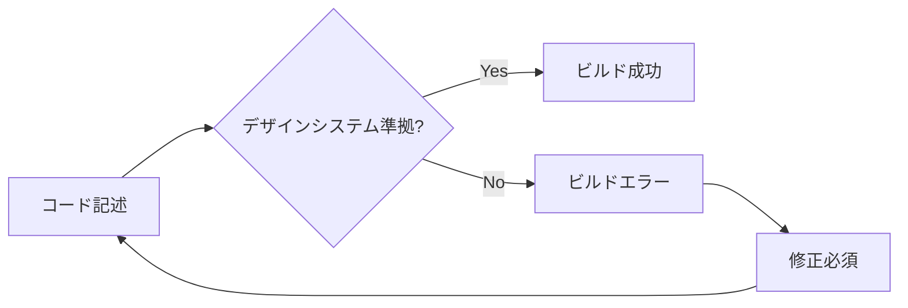

# ADR-002: 実装強制型デザインシステムの確立

**日付**: 2025-01-25  
**ステータス**: 承認済  
**決定者**: Claude + ユーザー  
**関連文書**: SVELTE_DESIGN_SYSTEM_SPEC.md, ADR-001-SVELTE-MIGRATION.md

## 📝 概要
Svelte移行に伴い、統一性を強制的に保証する実装レベルのデザインシステムを確立する。

## 🎯 コンテキスト

### **現在の問題**
1. **統一性の欠如**
   - 各ページで異なる実装方式
   - インラインスタイルの無秩序な使用
   - スタイルガイドの形骸化

2. **長期開発での逸脱**
   - 仕様書があってもその場の判断で逸脱
   - 時間経過による意図からの乖離
   - VSCodeクラッシュ時の情報ロス

3. **メンテナンス性の低下**
   - 技術債務の蓄積
   - 新機能実装の困難化
   - コード品質の不均一

### **従来のアプローチの限界**
- **文書ベース**: 実装時に参照されない
- **ガイドライン**: 強制力がない
- **レビュー頼み**: 人的リソースに依存

## 🚀 決定内容
**実装レベルで統一性を強制するデザインシステムを確立する**

## 🎯 理由

### **1. 強制的統一性の必要性**
開発者の判断に依存しない、システムレベルでの統一性保証が必須。

### **2. 過去の失敗経験**
```
仕様書 → 実装時に無視 → 独自判断 → 統一性破綻
```
この負のサイクルを技術的に断ち切る必要。

### **3. Svelteの特性活用**
- コンパイル時チェック
- スコープドスタイル
- 型安全性による制約

## 🏗️ 実装戦略

### **1. デザイントークンの実装強制**
```javascript
// design-tokens.js - 単一の真実の源
export const tokens = {
  colors: {
    primary: '#059669',
    primaryHover: '#047857',
    // 他の色は存在しない = 使用不可能
  },
  spacing: {
    xs: '4px',
    sm: '8px',
    md: '16px',
    // 他の値は使用不可能
  }
};
```

**強制メカニズム**:
- TypeScriptで使用可能な値を限定
- ESLintルールで違反を検出
- ビルド時エラーで不正使用を阻止

### **2. 基本コンポーネントの制約**
```svelte
<!-- Button.svelte -->
<script>
  export let variant: 'primary' | 'secondary' | 'ghost' = 'primary';
  export let size: 'sm' | 'md' | 'lg' = 'md';
  // 他のプロパティは型レベルで拒否
</script>
```

**制約メカニズム**:
- TypeScriptによる厳密な型定義
- プロパティの限定による選択肢の制限
- カスタムスタイルの技術的不可能化

### **3. Lintルールによる自動検証**
```javascript
// .eslintrc.js
module.exports = {
  rules: {
    'no-inline-styles': 'error',        // style属性禁止
    'use-design-tokens': 'error',       // トークン外の値禁止
    'use-base-components': 'error',     // 基本コンポーネント必須
    'no-custom-colors': 'error'        // 独自色禁止
  }
};
```

### **4. CIによる品質ゲート**
```yaml
# .github/workflows/design-check.yml
- name: Design System Compliance
  run: |
    npm run lint:design
    npm run test:visual-regression
    npm run build:strict
```

## 📋 コンポーネント階層

### **Tier 1: 基本コンポーネント（変更禁止）**
- `Card.svelte`: 情報表示の基本単位
- `Button.svelte`: 全ボタンの統一
- `Input.svelte`: フォーム要素

### **Tier 2: 音響専用コンポーネント（音響処理専用）**
- `VolumeBar.svelte`: DOM直接操作あり
- `PitchDisplay.svelte`: リアルタイム表示
- `NoteGrid.svelte`: ドレミファソラシド表示

### **Tier 3: 複合コンポーネント（基本コンポーネント組み合わせ）**
- `PageLayout.svelte`: 共通レイアウト
- `MicPermissionCard.svelte`: マイク許可UI

## 🚫 禁止事項の技術的実装

### **1. インラインstyle属性の禁止**
```javascript
// ESLint Rule
'svelte/no-inline-styles': ['error', {
  allowedProperties: [], // 一切許可しない
  exceptions: ['VolumeBar', 'PitchDisplay'] // 音響UIのみ例外
}]
```

### **2. カスタム色の使用禁止**
```typescript
// types.ts
type AllowedColors = 
  | 'var(--color-primary)'
  | 'var(--color-secondary)'
  | 'var(--color-success)'
  // これ以外は型エラー
```

### **3. スペーシングの制限**
```css
/* 使用可能なクラスのみ定義 */
.p-xs { padding: var(--space-xs); }
.p-sm { padding: var(--space-sm); }
.p-md { padding: var(--space-md); }
/* 他のスペーシングは存在しない */
```

## 📊 品質保証メカニズム

### **1. 自動化されたチェック**
- **Pre-commit**: デザイン違反の検出
- **CI/CD**: 継続的な品質監視
- **Visual Regression**: UIの意図しない変更を検出

### **2. 開発体験の向上**
- **TypeScript**: 型安全による制約
- **ESLint**: リアルタイムな警告
- **Prettier**: 自動的なコード整形

### **3. 強制力のある仕組み**


## ⚠️ リスクと対策

### **技術的リスク**
| リスク | 影響度 | 対策 |
|--------|--------|------|
| 制約が過度で開発効率低下 | 中 | 段階的導入、必要に応じた制約緩和 |
| 音響UIでの制約との競合 | 高 | 明確な例外ルールの策定 |

### **運用リスク**
| リスク | 影響度 | 対策 |
|--------|--------|------|
| 開発者の反発 | 低 | 自動化による負担軽減 |
| 学習コストの増加 | 中 | 詳細なドキュメント、例外の明確化 |

## 📈 成功指標

### **定量的指標**
- **統一性スコア**: 95%以上（自動測定）
- **デザイン違反**: 0件（CI/CDで検出）
- **コード重複**: 50%削減

### **定性的指標**
- **新機能開発**: より高速で確実
- **バグ減少**: スタイル関連の不具合ゼロ
- **コードレビュー**: デザイン観点の指摘不要

## 🔄 進化戦略

### **段階的導入**
1. **Phase 1**: 基本コンポーネントの確立
2. **Phase 2**: Lintルールの段階的追加
3. **Phase 3**: 完全な強制システムの確立

### **継続的改善**
- 開発者フィードバックの収集
- 制約の適切性の定期見直し
- 新しい要求への対応

## 🎯 期待される成果

### **短期的成果（1-2週間）**
- 統一されたUIコンポーネント
- デザイン違反の自動検出

### **中期的成果（1-2ヶ月）**
- 開発効率の向上
- バグ減少とコード品質向上

### **長期的成果（3ヶ月以上）**
- 持続可能な開発体制
- 新機能追加の高速化

---

**このデザインシステムは、技術的制約により統一性を保証し、長期的な品質維持を実現します。**