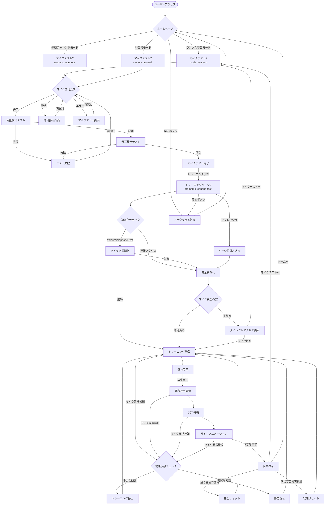
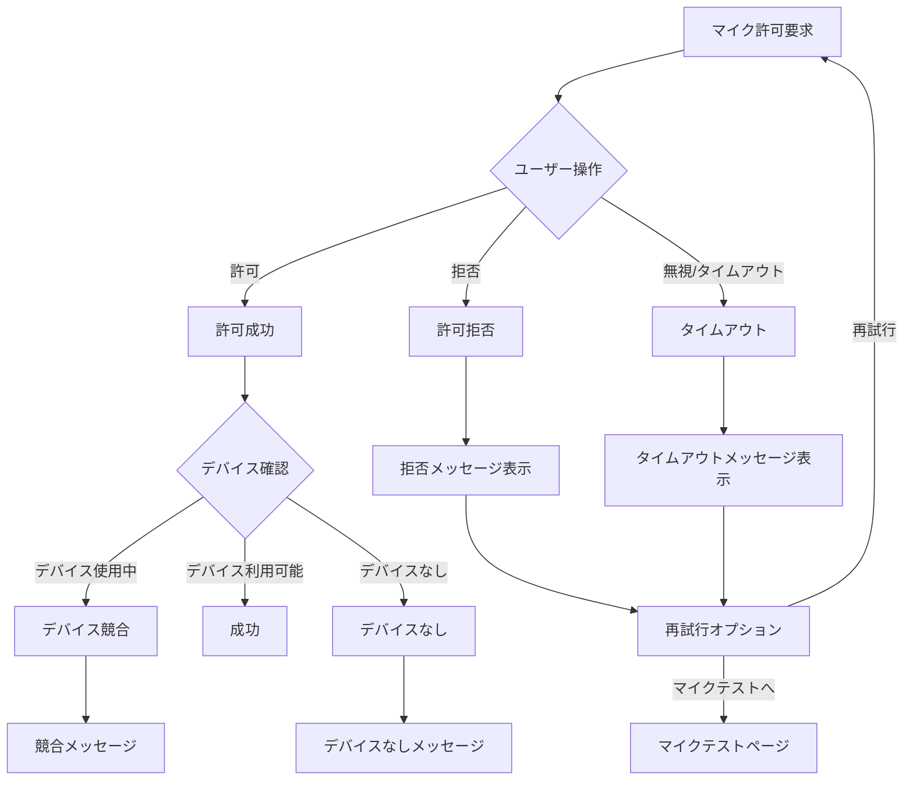
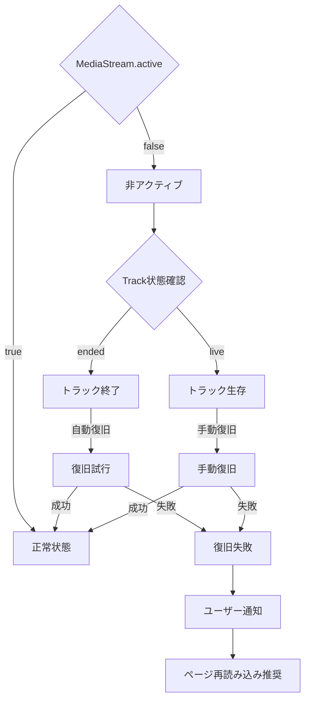
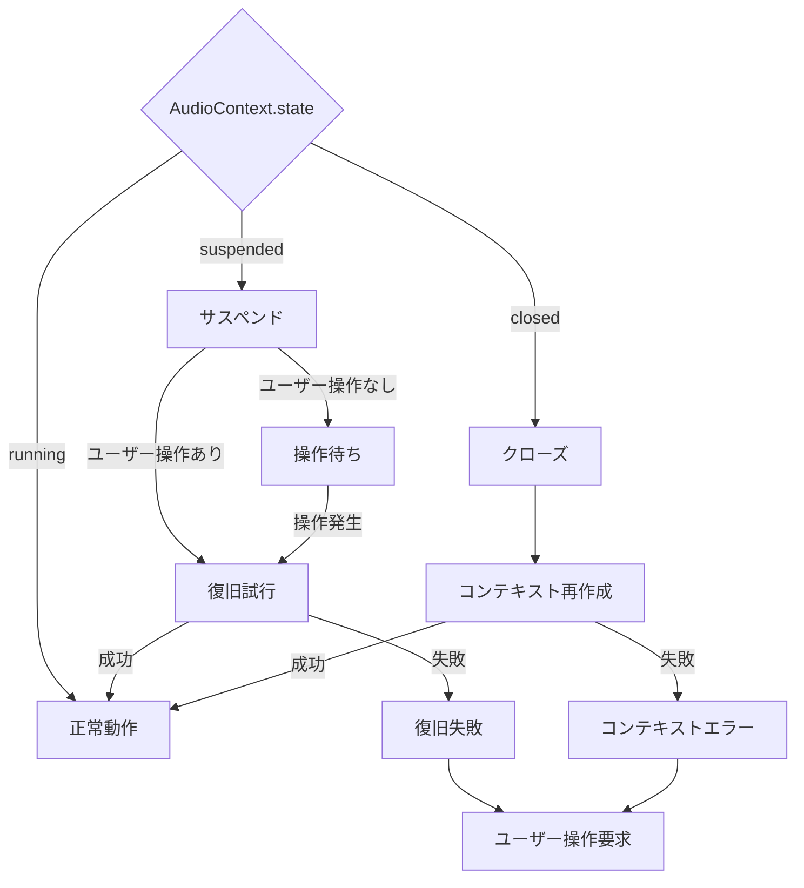
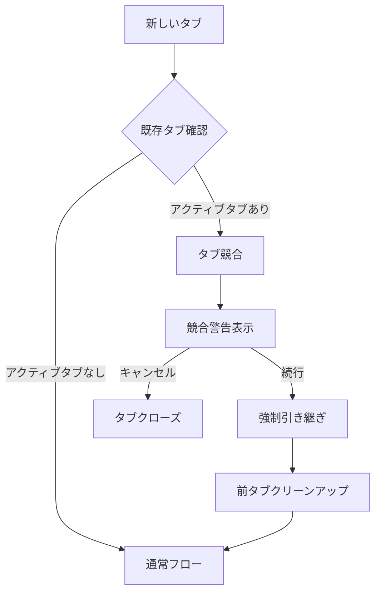
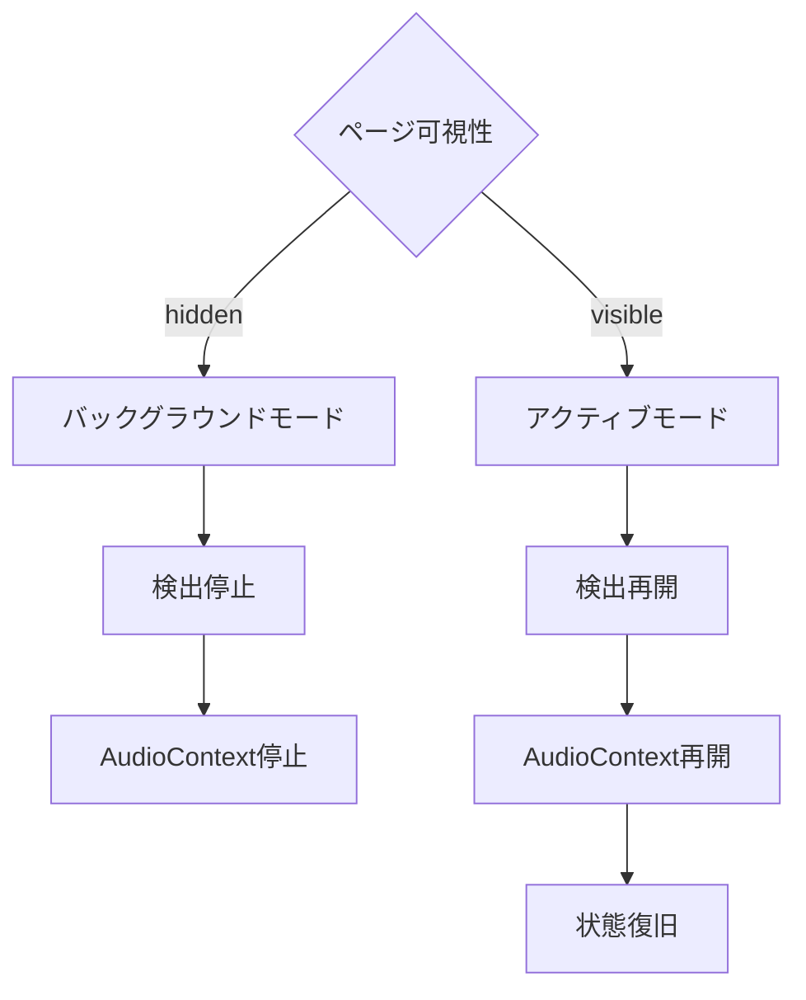

# 包括的ユーザーフロー仕様書

**作成日**: 2025-07-27  
**バージョン**: v1.0.0  
**対象**: SvelteKit相対音感トレーニングアプリ

## 📋 概要

この仕様書は、相対音感トレーニングアプリケーションの完全なユーザーフローを定義します。正常系・異常系の両方を網羅し、マイク制御を含む全ての状態遷移を詳細に記述します。

## 🎯 フロー構成要素

### **主要コンポーネント**
- **ホームページ** (`/`)
- **マイクテストページ** (`/microphone-test`)  
- **トレーニングページ** (`/training/{mode}`)
- **PitchDetectorコンポーネント**

### **状態管理レイヤー**
1. **ページレベル状態**: `trainingPhase`, `microphoneState`
2. **コンポーネントレベル状態**: `componentState`, `isActive` 
3. **健康監視レベル状態**: `microphoneHealthy`, `microphoneErrors`

## 🔄 完全ユーザーフロー図

## 📊 状態遷移表

### **trainingPhase状態遷移**

| 現在の状態 | トリガー | 次の状態 | 条件 |
|------------|----------|----------|------|
| setup | 基音再生ボタン押下 | listening | canStartTraining = true |
| listening | 再生完了 | waiting | 2秒経過 |
| waiting | ガイド開始 | guiding | 0.5秒経過 |
| guiding | 8音階完了 | results | 全ステップ完了 |
| results | 再挑戦ボタン | setup | ユーザー操作 |
| any | マイク異常 | setup | microphoneHealthy = false |

### **microphoneState状態遷移**

| 現在の状態 | トリガー | 次の状態 | 処理内容 |
|------------|----------|----------|----------|
| checking | 初期化開始 | checking | マイク状態確認中 |
| checking | 許可確認成功 | granted | PitchDetector初期化 |
| checking | 許可確認失敗 | denied | ダイレクトアクセス画面 |
| granted | マイク異常検知 | error | エラー処理開始 |
| denied | マイク許可取得 | granted | 状態復旧 |
| error | 復旧成功 | granted | 正常状態復帰 |

### **PitchDetector componentState遷移**

| 現在の状態 | トリガー | 次の状態 | 処理内容 |
|------------|----------|----------|----------|
| uninitialized | initialize() | initializing | MediaStream取得開始 |
| initializing | 初期化成功 | ready | AudioContext構築完了 |
| initializing | 初期化失敗 | error | エラー状態へ |
| ready | isActive=true | detecting | 音程検出開始 |
| detecting | isActive=false | ready | 音程検出停止 |
| error | 復旧処理 | initializing | 再初期化 |

## 🚨 異常系フロー詳細

### **A. マイク許可関連エラー**

### **B. MediaStream異常処理**

### **C. AudioContext問題処理**

## 🔄 復旧戦略

### **自動復旧対象**
- MediaStream一時的切断
- AudioContext suspend
- 軽微なデバイス競合
- ネットワーク一時的問題

### **手動復旧対象**  
- マイク許可取り消し
- デバイス物理的切断
- 他アプリによる占有
- ブラウザ権限変更

### **復旧不可対象**
- ハードウェア故障
- ドライバー問題
- 古いブラウザ非対応
- セキュリティポリシー制限

## 📱 特殊なケース処理

### **複数タブ処理**

### **バックグラウンド処理**

## 📋 フロー検証チェックリスト

### **正常系検証**
- [ ] ホームページからマイクテストへの遷移
- [ ] マイクテストからトレーニングページへの遷移
- [ ] 基音再生から結果表示までの完全フロー
- [ ] 再挑戦ボタンでの状態リセット
- [ ] マイクテスト経由での状態引き継ぎ

### **異常系検証**
- [ ] マイク許可拒否時の適切な誘導
- [ ] MediaStream突然切断時の復旧
- [ ] AudioContext suspend時の再開
- [ ] デバイス競合時の適切なエラー表示
- [ ] ネットワーク問題時の処理

### **境界値検証**
- [ ] 長時間放置後の状態保持
- [ ] 複数タブでの同時アクセス
- [ ] バックグラウンドタブからの復帰
- [ ] ページリフレッシュ時の状態復旧
- [ ] ブラウザ戻るボタンでの適切な処理

## 🚀 今後の拡張ポイント

### **Phase 1: 基本安定性向上**
- AudioContext自動suspend対応
- ブラウザ戻るボタン完全対応
- 権限リアルタイム監視

### **Phase 2: ユーザー体験向上**
- 詳細なエラーガイダンス
- 自動復旧機能強化
- オフライン対応

### **Phase 3: 高度な機能**
- マルチデバイス対応
- セッション永続化
- パフォーマンス最適化

---

**この仕様書により、開発者は全てのユーザーフローとエラーケースを理解し、堅牢なアプリケーションの構築が可能になります。**