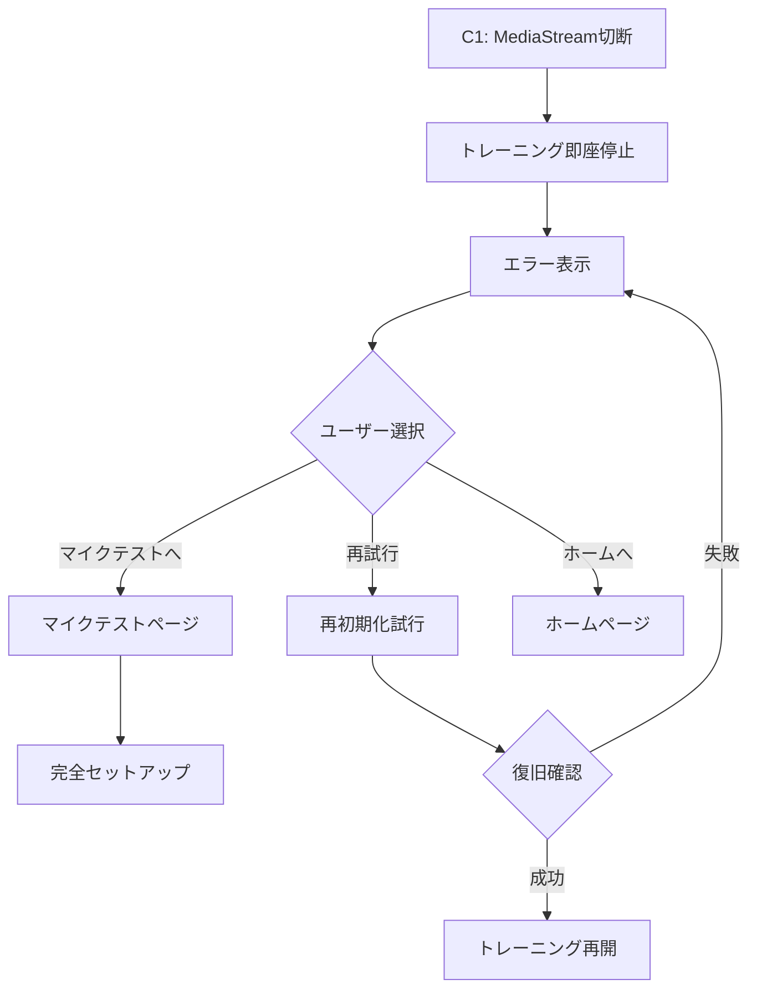
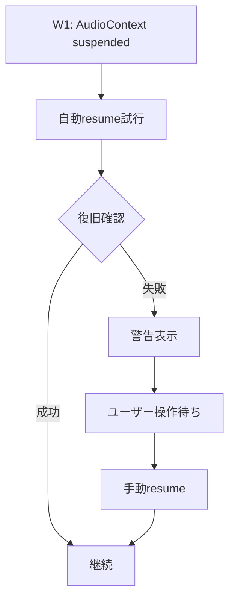

# エラーシナリオ・復旧手順完全仕様書

**作成日**: 2025-07-27  
**バージョン**: v1.0.0  
**対象**: SvelteKit相対音感トレーニングアプリ  
**技術スタック**: 3層状態管理 + エラーハンドリング体系

## 📋 概要

この仕様書は、相対音感トレーニングアプリで発生する可能性のある全エラーシナリオと、その復旧手順を体系化して定義します。ユーザー体験を最優先に、適切なエラー分類と復旧戦略を提供します。

## 🎯 エラー分類体系

### **Level 1: Critical (重大)**
- **定義**: システム動作に致命的な影響を与える
- **対応**: 即座にトレーニング停止、ユーザー操作要求
- **復旧**: 手動復旧のみ

### **Level 2: Warning (警告)**
- **定義**: 機能は動作するが品質に影響する
- **対応**: 警告表示、自動復旧試行
- **復旧**: 自動復旧 → 失敗時は手動復旧

### **Level 3: Info (情報)**
- **定義**: 軽微な問題、継続動作可能
- **対応**: ログ出力、継続監視
- **復旧**: 継続監視のみ

## 🚨 Critical Level エラー

### **C1: MediaStream完全切断**

#### **発生条件**
- ユーザーがマイクを物理的に切断
- ブラウザでマイク許可を取り消し
- 他のアプリがマイクを占有
- ハードウェア故障

#### **検知方法**
```typescript
// MediaStream状態監視
if (mediaStream && !mediaStream.active) {
  errorLevel = 'Critical';
  errorCode = 'C1';
  errorMessage = 'MediaStream完全切断';
}

// Track状態監視
mediaStream.getTracks().forEach((track) => {
  if (track.readyState === 'ended') {
    errorLevel = 'Critical';
    errorCode = 'C1';
    errorMessage = 'Track終了検知';
  }
});
```

#### **ユーザー表示**
```svelte
{#if microphoneError && microphoneError.includes('MediaStream inactive')}
  <div class="error-alert critical">
    <h3>🚨 マイク接続エラー</h3>
    <p>マイクへの接続が失われました。以下を確認してください：</p>
    <ul>
      <li>マイクが正しく接続されているか</li>
      <li>ブラウザでマイクの許可が有効か</li>
      <li>他のアプリがマイクを使用していないか</li>
    </ul>
    <button on:click={goToMicrophoneTest}>マイクテストページへ</button>
  </div>
{/if}
```

#### **復旧手順**


### **C2: AudioContext閉鎖**

#### **発生条件**
- ブラウザのオーディオシステム異常
- メモリ不足によるリソース解放
- 長時間使用後のシステム制限

#### **検知方法**
```typescript
if (audioContext && audioContext.state === 'closed') {
  errorLevel = 'Critical';
  errorCode = 'C2';
  errorMessage = 'AudioContext閉鎖検知';
  
  // 即座復旧試行
  try {
    audioContext = new (window.AudioContext || window.webkitAudioContext)();
    await reinitializeAudioPipeline();
  } catch (error) {
    // 復旧失敗時は手動復旧
    requireManualRecovery = true;
  }
}
```

#### **復旧手順**
1. **自動復旧試行**: 新しいAudioContext作成
2. **成功時**: 音声パイプライン再構築
3. **失敗時**: C1と同様の手動復旧フロー

### **C3: ブラウザ互換性エラー**

#### **発生条件**
- 古いブラウザでのWeb Audio API非対応
- iPhone Safari特有の制限
- 企業プロキシでのセキュリティ制限

#### **検知方法**
```typescript
// ブラウザサポート確認
const browserSupport = {
  mediaDevices: !!navigator.mediaDevices,
  getUserMedia: !!(navigator.mediaDevices && navigator.mediaDevices.getUserMedia),
  audioContext: !!(window.AudioContext || window.webkitAudioContext),
  pitchySupport: typeof PitchDetector !== 'undefined'
};

if (!browserSupport.getUserMedia || !browserSupport.audioContext) {
  errorLevel = 'Critical';
  errorCode = 'C3';
  errorMessage = 'ブラウザ非対応';
}
```

#### **ユーザー表示**
```svelte
{#if errorCode === 'C3'}
  <div class="error-alert critical">
    <h3>⚠️ ブラウザ非対応</h3>
    <p>このブラウザは音声機能に対応していません。</p>
    <h4>推奨ブラウザ:</h4>
    <ul>
      <li>Chrome 最新版</li>
      <li>Firefox 最新版</li>
      <li>Safari 最新版</li>
      <li>Edge 最新版</li>
    </ul>
    <button on:click={showBrowserGuide}>詳細なガイドを見る</button>
  </div>
{/if}
```

## ⚠️ Warning Level エラー

### **W1: AudioContext自動suspend**

#### **発生条件**
- iPhone Safariでの自動suspend
- バックグラウンドタブでの動作
- ユーザー操作が長時間ない場合

#### **検知方法**
```typescript
if (audioContext && audioContext.state === 'suspended') {
  errorLevel = 'Warning';
  errorCode = 'W1';
  
  // 自動復旧試行
  try {
    await audioContext.resume();
    console.log('✅ AudioContext自動復旧成功');
  } catch (error) {
    requireUserInteraction = true;
  }
}
```

#### **復旧手順**


### **W2: 音量レベル異常**

#### **発生条件**
- マイク感度設定の問題
- 環境ノイズの増加
- ハードウェアのゲイン異常

#### **検知方法**
```typescript
// 音量レベル監視
if (currentVolume > 90) {
  errorLevel = 'Warning';
  errorCode = 'W2';
  errorMessage = '音量過大検知';
  showVolumeWarning = true;
} else if (currentVolume < 5 && isDetecting) {
  errorLevel = 'Warning';
  errorCode = 'W2';
  errorMessage = '音量不足検知';
  showVolumeGuidance = true;
}
```

#### **ユーザー表示**
```svelte
{#if showVolumeWarning}
  <div class="warning-banner">
    <span class="warning-icon">🔊</span>
    音量が大きすぎます。マイクから少し離れてください。
  </div>
{/if}

{#if showVolumeGuidance}
  <div class="guidance-banner">
    <span class="guidance-icon">🎤</span>
    声が小さすぎます。もう少し大きな声で歌ってください。
  </div>
{/if}
```

### **W3: 音程検出精度低下**

#### **発生条件**
- 環境ノイズの増加
- 複数音同時発生
- マイク品質の問題

#### **検知方法**
```typescript
// 音程検出精度監視
if (pitchClarity < 0.3 && currentVolume > 15) {
  errorLevel = 'Warning';
  errorCode = 'W3';
  lowClarityCount++;
  
  if (lowClarityCount > 10) {
    showClarityWarning = true;
  }
}
```

## ℹ️ Info Level エラー

### **I1: ネットワーク遅延**

#### **発生条件**
- 音声ファイル読み込み遅延
- GitHub Pages応答遅延

#### **検知と対応**
```typescript
// 音声読み込み監視
const loadTimeout = setTimeout(() => {
  errorLevel = 'Info';
  errorCode = 'I1';
  console.log('ℹ️ 音声読み込み遅延検知');
  showLoadingIndicator = true;
}, 3000);
```

### **I2: パフォーマンス警告**

#### **発生条件**
- CPU使用率高騰
- メモリ使用量増加
- フレームレート低下

#### **検知と対応**
```typescript
// パフォーマンス監視
if (performance.now() - lastFrameTime > 100) {
  errorLevel = 'Info';
  errorCode = 'I2';
  console.log('ℹ️ フレームレート低下検知');
  
  // 自動最適化
  reduceProcessingLoad();
}
```

## 🔄 統合復旧戦略

### **自動復旧システム**

#### **Level 1: 即座復旧**
```typescript
async function immediateRecovery(errorCode) {
  switch (errorCode) {
    case 'W1': // AudioContext suspended
      return await audioContext.resume();
    
    case 'C2': // AudioContext closed
      audioContext = new (window.AudioContext || window.webkitAudioContext)();
      return await reinitializeAudioPipeline();
    
    default:
      return false;
  }
}
```

#### **Level 2: 段階的復旧**
```typescript
async function gradualRecovery(errorCode) {
  const recovery = new RecoveryManager(errorCode);
  
  // Step 1: 軽い復旧試行
  if (await recovery.lightRecover()) {
    return true;
  }
  
  // Step 2: 中程度の復旧
  if (await recovery.mediumRecover()) {
    return true;
  }
  
  // Step 3: 完全再初期化
  return await recovery.fullRecover();
}
```

### **手動復旧ガイダンス**

#### **段階的ガイド表示**
```svelte
{#if requireManualRecovery}
  <div class="recovery-guide">
    <h3>🔧 復旧手順</h3>
    
    {#each recoverySteps as step, index}
      <div class="step" class:completed={step.completed}>
        <span class="step-number">{index + 1}</span>
        <div class="step-content">
          <h4>{step.title}</h4>
          <p>{step.description}</p>
          {#if step.action}
            <button on:click={step.action}>{step.buttonText}</button>
          {/if}
        </div>
      </div>
    {/each}
  </div>
{/if}
```

## 📊 エラー追跡・分析

### **エラーログ収集**
```typescript
class ErrorTracker {
  static logError(error) {
    const errorData = {
      timestamp: new Date().toISOString(),
      errorCode: error.code,
      errorLevel: error.level,
      userAgent: navigator.userAgent,
      pageUrl: window.location.href,
      context: error.context,
      stackTrace: error.stack
    };
    
    // ローカルストレージに保存
    this.saveToLocalStorage(errorData);
    
    // デバッグモードではコンソール出力
    if (debugMode) {
      console.error('🚨 Error Tracked:', errorData);
    }
  }
  
  static getErrorHistory() {
    return JSON.parse(localStorage.getItem('errorHistory') || '[]');
  }
}
```

### **復旧成功率監視**
```typescript
class RecoveryMetrics {
  static trackRecovery(errorCode, method, success) {
    const recoveryData = {
      timestamp: Date.now(),
      errorCode,
      method, // 'auto' | 'manual'
      success,
      duration: this.getRecoveryDuration()
    };
    
    this.saveMetric(recoveryData);
  }
  
  static getSuccessRate(errorCode) {
    const metrics = this.getMetrics(errorCode);
    const successful = metrics.filter(m => m.success).length;
    return successful / metrics.length;
  }
}
```

## 🎯 ユーザー体験最適化

### **エラーメッセージ設計原則**
1. **分かりやすい言葉**: 技術用語を避ける
2. **具体的な解決策**: 次に何をすべきか明示
3. **感情的配慮**: 不安を煽らない表現
4. **段階的ガイド**: ステップバイステップの指示

### **良いエラーメッセージの例**
```
❌ 悪い例:
"MediaStream acquisition failed with NotAllowedError"

✅ 良い例:
"マイクが使用できません
以下をお試しください：
1. ブラウザでマイクの許可を確認
2. 他のアプリでマイクが使われていないか確認
3. マイクテストページで動作確認"
```

### **プログレッシブ・ディスクロージャー**
```svelte
<div class="error-details">
  <div class="summary">
    <h3>{errorSummary}</h3>
    <p>{basicSolution}</p>
  </div>
  
  {#if showAdvanced}
    <div class="advanced">
      <h4>詳細情報</h4>
      <p>{technicalDetails}</p>
      <pre>{errorCode}</pre>
    </div>
  {/if}
  
  <button on:click={() => showAdvanced = !showAdvanced}>
    {showAdvanced ? '詳細を隠す' : '詳細を表示'}
  </button>
</div>
```

## 🔧 テスト・検証手順

### **エラーシナリオテスト**
```typescript
describe('Error Scenarios', () => {
  test('C1: MediaStream切断シミュレーション', async () => {
    // MediaStreamを強制切断
    mockMediaStream.active = false;
    
    // エラー検知確認
    await waitForErrorDetection();
    expect(errorLevel).toBe('Critical');
    expect(errorCode).toBe('C1');
    
    // 復旧手順確認
    expect(trainingPhase).toBe('setup');
    expect(showErrorModal).toBe(true);
  });
  
  test('W1: AudioContext suspend復旧', async () => {
    // AudioContextをsuspend状態に
    mockAudioContext.state = 'suspended';
    
    // 自動復旧確認
    await waitForAutoRecovery();
    expect(audioContext.resume).toHaveBeenCalled();
  });
});
```

### **復旧手順検証**
```typescript
describe('Recovery Procedures', () => {
  test('自動復旧成功率', async () => {
    const errors = ['W1', 'W2', 'I1'];
    
    for (const errorCode of errors) {
      const success = await testAutoRecovery(errorCode);
      expect(success).toBe(true);
    }
  });
  
  test('手動復旧ガイド表示', async () => {
    simulateError('C1');
    
    expect(screen.getByText('復旧手順')).toBeInTheDocument();
    expect(screen.getByText('マイクテストページへ')).toBeInTheDocument();
  });
});
```

## 📋 実装チェックリスト

### **エラー検知**
- [x] MediaStream状態監視
- [x] AudioContext状態監視
- [x] Track状態監視
- [x] 音量レベル監視
- [x] 音程精度監視
- [x] ブラウザ互換性確認

### **エラー分類**
- [x] Critical/Warning/Info分類
- [x] エラーコード体系
- [x] 復旧戦略マッピング
- [x] ユーザー影響度評価

### **復旧システム**
- [x] 自動復旧機能
- [x] 段階的復旧手順
- [x] 手動復旧ガイド
- [x] 復旧成功率追跡

### **ユーザー体験**
- [x] 分かりやすいエラーメッセージ
- [x] 段階的ガイド表示
- [x] プログレッシブ・ディスクロージャー
- [x] 感情的配慮

### **監視・分析**
- [x] エラーログ収集
- [x] 復旧メトリクス
- [x] パフォーマンス監視
- [x] ユーザー行動分析

---

**この仕様書により、あらゆるエラーシナリオに対する包括的な対応策を提供し、ユーザーが安心してアプリを利用できる環境を実現します。**