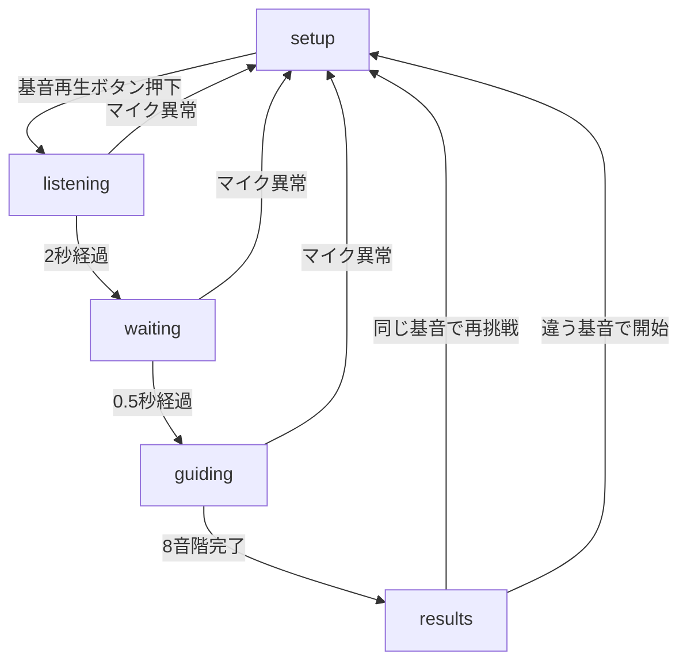
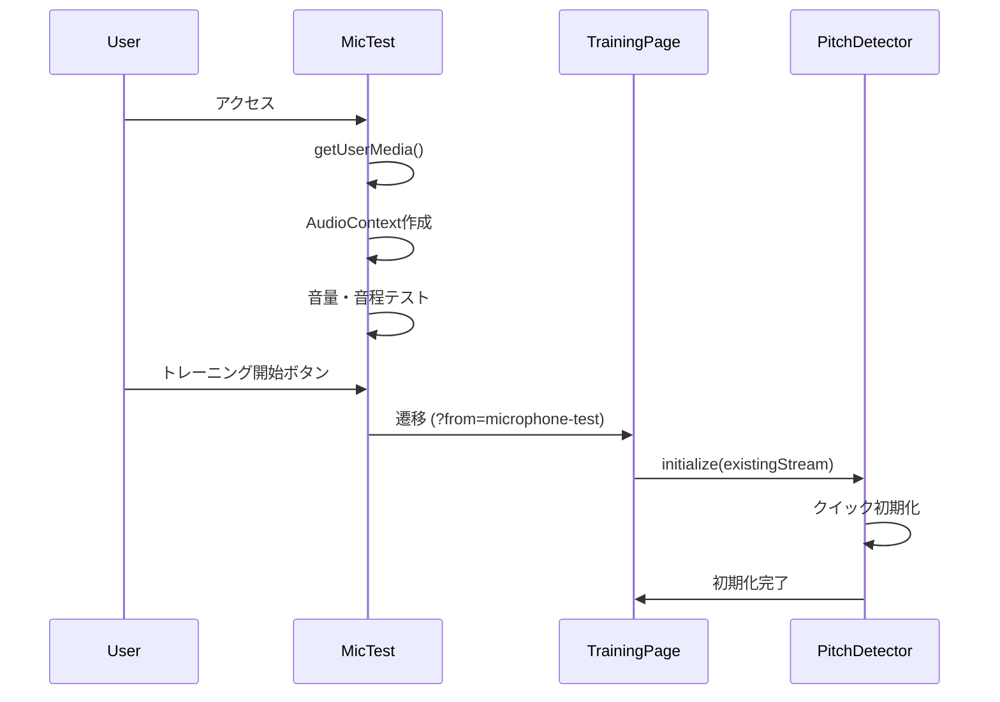
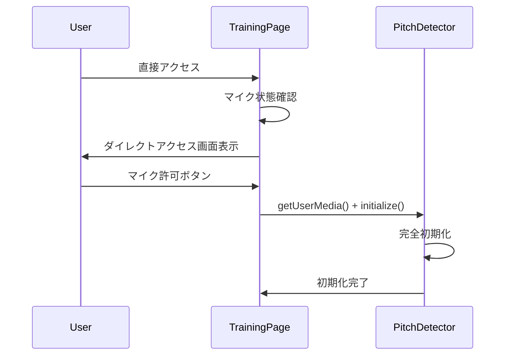
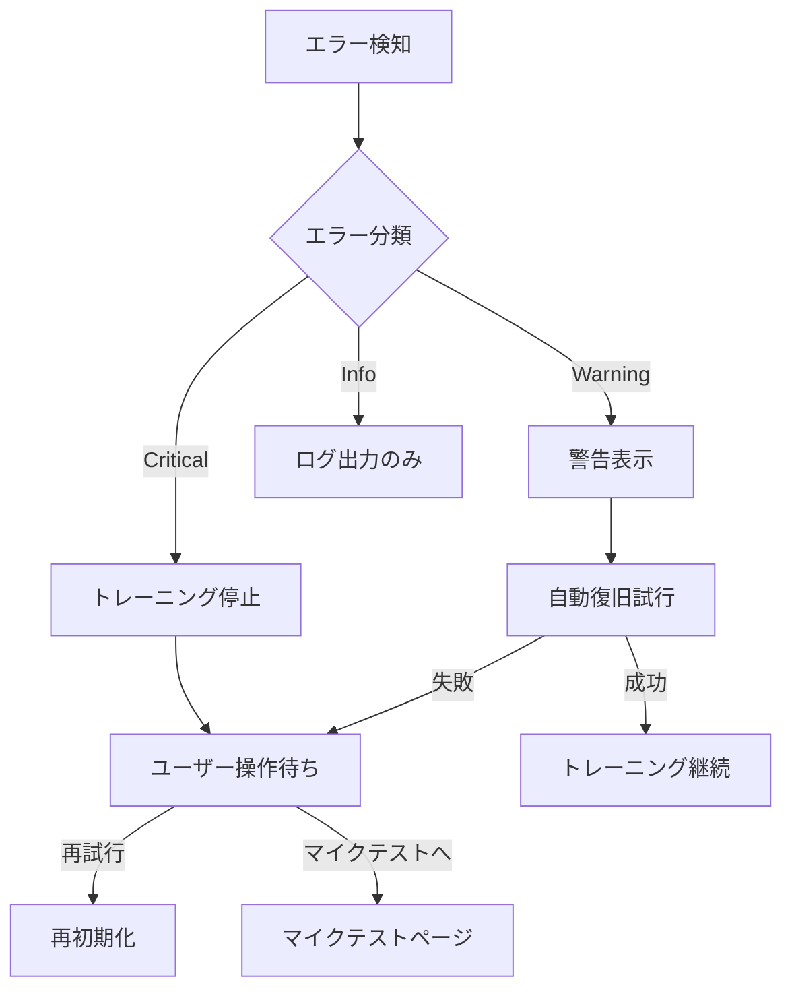

# マイク制御完全仕様書

**作成日**: 2025-07-27  
**バージョン**: v2.0.0  
**対象**: SvelteKit相対音感トレーニングアプリ  
**技術スタック**: PitchDetector.svelte + 3層状態管理

## 📋 概要

この仕様書は、相対音感トレーニングアプリにおけるマイク制御システムの完全な技術仕様を定義します。3層の状態管理アーキテクチャを採用し、リアルタイム音程検出とエラー処理を実現しています。

## 🏗️ 3層状態管理アーキテクチャ

### **Layer 1: Page Level State (ページレベル状態)**
- **責任範囲**: UI表示制御、ユーザーフロー管理
- **管理ファイル**: `/routes/training/random/+page.svelte`
- **主要状態**: `trainingPhase`, `microphoneState`

### **Layer 2: Component Level State (コンポーネントレベル状態)**
- **責任範囲**: PitchDetector内部状態、初期化管理
- **管理ファイル**: `/lib/components/PitchDetector.svelte`
- **主要状態**: `componentState`, `isActive`, `isInitialized`

### **Layer 3: Health Monitoring State (健康監視レベル状態)**
- **責任範囲**: MediaStream監視、AudioContext監視、エラー検知
- **管理ファイル**: PitchDetector内部 `checkMicrophoneStatus()`
- **主要状態**: `microphoneHealthy`, `errorDetails`

## 🎯 マイクロフォン制御仕様

## 🎯 Layer 1: Page Level State

### **State Definition**
```typescript
// ページレベル状態
let trainingPhase = 'setup';           // 'setup' | 'listening' | 'waiting' | 'guiding' | 'results'
let microphoneState = 'checking';      // 'checking' | 'granted' | 'denied' | 'error'
let microphoneHealthy = true;          // マイクの健康状態
let microphoneError = null;            // エラー詳細
let canStartTraining = false;          // トレーニング開始可能フラグ
```

### **State Transitions**


### **Microphone State Management**
```typescript
// マイク状態確認
$: canStartTraining = microphoneState === 'granted' && microphoneHealthy;

// マイク健康状態監視イベント
function handleMicrophoneHealthChange(event) {
  const { healthy, errors, details } = event.detail;
  
  microphoneHealthy = healthy;
  microphoneError = errors.length > 0 ? errors : null;
  
  // 重大な問題の場合はトレーニング停止
  if (!healthy && (trainingPhase === 'listening' || trainingPhase === 'waiting' || trainingPhase === 'guiding')) {
    console.warn('🚨 [Page] Microphone health issue detected, stopping training', details);
    trainingPhase = 'setup';
  }
}
```

## 🎛️ Layer 2: Component Level State

### **State Definition**
```typescript
// コンポーネント内部状態
let componentState = 'uninitialized';  // 'uninitialized' | 'initializing' | 'ready' | 'detecting' | 'error'
let isInitialized = false;             // 初期化完了フラグ
let isDetecting = false;               // 検出実行中フラグ
let lastError = null;                  // 最後のエラー
```

### **State Transitions**
```mermaid
flowchart TD
    Uninitialized[uninitialized] --> |initialize()| Initializing[initializing]
    Initializing --> |成功| Ready[ready]
    Initializing --> |失敗| Error[error]
    Ready --> |startDetection()| Detecting[detecting]
    Detecting --> |stopDetection()| Ready
    Error --> |reinitialize()| Initializing
    
    %% 外部からの制御
    Ready --> |isActive=true| Detecting
    Detecting --> |isActive=false| Ready
```

### **Core APIs**
```typescript
// 初期化API
export async function initialize(stream) {
  try {
    componentState = 'initializing';
    
    // MediaStream設定
    mediaStream = stream;
    
    // AudioContext作成・再開
    if (!audioContext) {
      audioContext = new (window.AudioContext || window.webkitAudioContext)();
    }
    if (audioContext.state === 'suspended') {
      await audioContext.resume();
    }
    
    // 3段階ノイズリダクション設定
    setupNoiseReduction();
    
    // PitchDetector設定
    pitchDetector = PitchDetector.forFloat32Array(analyser.fftSize);
    
    componentState = 'ready';
    isInitialized = true;
    
    dispatch('stateChange', { state: componentState });
    
  } catch (error) {
    componentState = 'error';
    lastError = error;
    dispatch('error', { error, context: 'initialization' });
    throw error;
  }
}

// 検出開始API
export function startDetection() {
  if (componentState !== 'ready') {
    const error = new Error(`Cannot start detection: component state is ${componentState}`);
    dispatch('error', { error, context: 'start-detection' });
    return false;
  }
  
  componentState = 'detecting';
  isDetecting = true;
  dispatch('stateChange', { state: componentState });
  detectPitch();
  return true;
}

// 表示状態リセットAPI
export function resetDisplayState() {
  currentVolume = 0;
  rawVolume = 0;
  currentFrequency = 0;
  detectedNote = 'ーー';
  pitchClarity = 0;
  
  // バッファクリア
  frequencyHistory = [];
  volumeHistory = [];
  harmonicHistory = [];
}
```

## 🔍 Layer 3: Health Monitoring State

### **Monitoring System**
```typescript
// マイク健康状態監視（3秒間隔）
function checkMicrophoneStatus() {
  if (!debugMode) return;
  
  const timestamp = new Date().toLocaleTimeString();
  let microphoneHealthy = true;
  let errorDetails = [];
  
  // MediaStream状態チェック
  if (mediaStream && !mediaStream.active) {
    console.warn(`⚠️ [PitchDetector] MediaStream is inactive!`, mediaStream);
    microphoneHealthy = false;
    errorDetails.push('MediaStream inactive');
  }
  
  // AudioContext状態チェック
  if (audioContext && audioContext.state === 'suspended') {
    console.warn(`⚠️ [PitchDetector] AudioContext is suspended!`, audioContext);
    microphoneHealthy = false;
    errorDetails.push('AudioContext suspended');
  }
  
  // Track状態チェック
  if (mediaStream) {
    mediaStream.getTracks().forEach((track, index) => {
      if (track.readyState === 'ended') {
        console.error(`❌ [PitchDetector] Track ${index} has ended!`, track);
        microphoneHealthy = false;
        errorDetails.push(`Track ${index} ended`);
      }
    });
  }
  
  // 親コンポーネントに通知
  dispatch('microphoneHealthChange', {
    healthy: microphoneHealthy,
    errors: errorDetails,
    details: {
      timestamp,
      componentState,
      isActive,
      isDetecting,
      isInitialized,
      mediaStreamActive: mediaStream ? mediaStream.active : null,
      audioContextState: audioContext ? audioContext.state : null
    }
  });
}
```

### **Health Check Items**
| チェック項目 | 正常状態 | 異常検知条件 | 影響レベル |
|-------------|----------|-------------|-----------|
| MediaStream.active | true | false | 重大 |
| AudioContext.state | 'running' | 'suspended', 'closed' | 重大 |
| Track.readyState | 'live' | 'ended' | 重大 |
| Track.enabled | true | false | 中程度 |
| Track.muted | false | true | 軽微 |

## 🔄 初期化パターン

### **Pattern 1: マイクテスト経由 (推奨)**


### **Pattern 2: ダイレクトアクセス**


## 🎤 3段階ノイズリダクションシステム

### **Filter Chain Architecture**
```
[MediaStreamSource] 
    ↓
[Raw Analyser] ← フィルター前解析（比較用）
    ↓
[High-pass Filter] ← 80Hz以下カット（低周波ノイズ除去）
    ↓  
[Low-pass Filter] ← 800Hz以上カット（高周波ノイズ除去）
    ↓
[Notch Filter] ← 60Hz電源ノイズ除去
    ↓
[Main Analyser] ← フィルター後解析（音程検出用）
```

### **Filter Configuration**
```typescript
// 1. ハイパスフィルター（低周波ノイズ除去）
highpassFilter = audioContext.createBiquadFilter();
highpassFilter.type = 'highpass';
highpassFilter.frequency.setValueAtTime(80, audioContext.currentTime);
highpassFilter.Q.setValueAtTime(0.7, audioContext.currentTime);

// 2. ローパスフィルター（高周波ノイズ除去）
lowpassFilter = audioContext.createBiquadFilter();
lowpassFilter.type = 'lowpass';
lowpassFilter.frequency.setValueAtTime(800, audioContext.currentTime);
lowpassFilter.Q.setValueAtTime(0.7, audioContext.currentTime);

// 3. ノッチフィルター（電源ノイズ除去）
notchFilter = audioContext.createBiquadFilter();
notchFilter.type = 'notch';
notchFilter.frequency.setValueAtTime(60, audioContext.currentTime);
notchFilter.Q.setValueAtTime(10, audioContext.currentTime);
```

## 🎵 高精度音程検出システム

### **Detection Pipeline**
```
[Float32Array Buffer] 
    ↓
[Volume Calculation] ← RMS音量計算
    ↓
[Pitch Detection] ← Pitchy (McLeod Pitch Method)
    ↓
[Vocal Range Filter] ← 65Hz-1200Hz人間音域フィルタリング
    ↓
[Harmonic Correction] ← 倍音補正システム
    ↓
[Frequency Stabilization] ← 基音安定化システム
    ↓
[Note Conversion] ← 周波数→音程名変換
```

### **Human Vocal Range Filtering**
```typescript
// 人間音域フィルタリング（実用調整）
const isValidVocalRange = pitch >= 65 && pitch <= 1200;

// 検出条件
if (pitch && clarity > 0.6 && currentVolume > 10 && isValidVocalRange) {
  // 有効な音程として処理
}
```

### **Harmonic Correction System**
```typescript
function correctHarmonicFrequency(detectedFreq, previousFreq) {
  // 基音候補生成
  const fundamentalCandidates = [
    detectedFreq,          // そのまま（基音）
    detectedFreq / 2.0,    // 2倍音 → 基音
    detectedFreq / 3.0,    // 3倍音 → 基音
    detectedFreq / 4.0,    // 4倍音 → 基音
    detectedFreq * 2.0,    // 1オクターブ上
  ];
  
  // 妥当性評価（人間音域40% + 連続性40% + 音楽性20%）
  const evaluateFundamental = (freq) => {
    const vocalRangeScore = (freq >= 130.81 && freq <= 1046.50) ? 1.0 : 0.0;
    const continuityScore = previousFreq > 0 
      ? 1.0 - Math.min(Math.abs(freq - previousFreq) / previousFreq, 1.0)
      : 0.5;
    const musicalScore = calculateMusicalScore(freq);
    
    return (vocalRangeScore * 0.4) + (continuityScore * 0.4) + (musicalScore * 0.2);
  };
  
  // 最高スコア候補を採用
  const bestCandidate = fundamentalCandidates
    .map(freq => ({ freq, score: evaluateFundamental(freq) }))
    .reduce((best, current) => current.score > best.score ? current : best);
    
  return bestCandidate.freq;
}
```

## 🚨 エラーハンドリング体系

### **Error Classification**
| エラーレベル | 例 | 対応方法 | 復旧戦略 |
|-------------|----|---------|---------| 
| **Critical** | MediaStream切断 | トレーニング停止 | 手動復旧 |
| **Warning** | AudioContext suspend | 警告表示 | 自動復旧 |
| **Info** | 一時的音量低下 | ログ出力のみ | 継続監視 |

### **Error Recovery Flow**


## 🔧 デバッグ機能

### **Debug Mode Activation**
```svelte
<!-- デバッグモード有効化 -->
<PitchDetector 
  bind:this={pitchDetectorComponent} 
  isActive={trainingPhase === 'waiting' || trainingPhase === 'guiding'}
  debugMode={true}
  on:pitchUpdate={handlePitchUpdate}
  on:microphoneHealthChange={handleMicrophoneHealthChange}
/>
```

### **Debug Output Example**
```
🎤 [PitchDetector] 14:35:22: {
  timestamp: "14:35:22",
  componentState: "detecting",
  isActive: true,
  isDetecting: true,
  isInitialized: true,
  mediaStreamActive: true,
  mediaStreamTracks: 1,
  trackStates: [{
    kind: "audio",
    enabled: true,
    readyState: "live",
    muted: false
  }],
  audioContextState: "running",
  hasAnalyser: true,
  currentVolume: 45.3,
  currentFrequency: 261
}
```

## 📱 クロスブラウザ対応

### **WebKit (Safari) 特殊対応**
```typescript
// AudioContext作成時のWebKit対応
audioContext = new (window.AudioContext || window.webkitAudioContext)();

// getUserMedia WebKit対応
if (navigator.mediaDevices && navigator.mediaDevices.getUserMedia) {
  // 標準API使用
} else if (navigator.webkitGetUserMedia) {
  // WebKit fallback
}
```

### **Browser Compatibility Matrix**
| 機能 | Chrome | Firefox | Safari | Edge |
|------|--------|---------|--------|------|
| MediaStream | ✅ | ✅ | ✅ | ✅ |
| AudioContext | ✅ | ✅ | ⚠️* | ✅ |
| BiquadFilter | ✅ | ✅ | ✅ | ✅ |
| Float32Array | ✅ | ✅ | ✅ | ✅ |

*Safari: AudioContext自動suspendあり

## 🔄 コンポーネント生存管理

### **使い回し設計**
```typescript
// onDestroy時の特殊処理
onDestroy(() => {
  // デバッグインターバルのクリア
  if (debugInterval) {
    clearInterval(debugInterval);
    debugInterval = null;
  }
  // 重要: MediaStreamとAudioContextはcleanupしない
  // セッション間での使い回しを実現
});
```

### **Session Persistence Strategy**
- **保持対象**: MediaStream, AudioContext, フィルターチェーン
- **リセット対象**: 表示状態, バッファ履歴, 検出フラグ
- **メリット**: セッション間の高速復帰, リソース効率化

## 📋 実装チェックリスト

### **基本機能**
- [x] 3層状態管理の完全実装
- [x] マイクテスト経由フローの対応
- [x] ダイレクトアクセスフローの対応
- [x] 3段階ノイズリダクションの実装
- [x] 高精度音程検出の実装

### **健康監視**
- [x] MediaStream状態監視
- [x] AudioContext状態監視  
- [x] Track状態監視
- [x] 3秒間隔での定期チェック
- [x] 親コンポーネントへの通知

### **エラー処理**
- [x] Critical/Warning/Infoレベル分類
- [x] 自動復旧機能
- [x] 手動復旧フロー
- [x] ユーザー分かりやすいエラーメッセージ

### **デバッグ機能**
- [x] デバッグモードの実装
- [x] 詳細ログ出力
- [x] コンソールでの状態確認
- [x] パフォーマンス監視

### **クロスブラウザ対応**
- [x] Chrome/Firefox/Safari/Edge対応
- [x] WebKit特殊対応
- [x] フォールバック実装
- [x] 互換性テスト

---

**この仕様書により、開発者はマイク制御システムの全体構造を理解し、堅牢で高性能な音程検出機能を実装できます。**