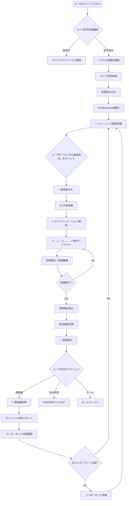
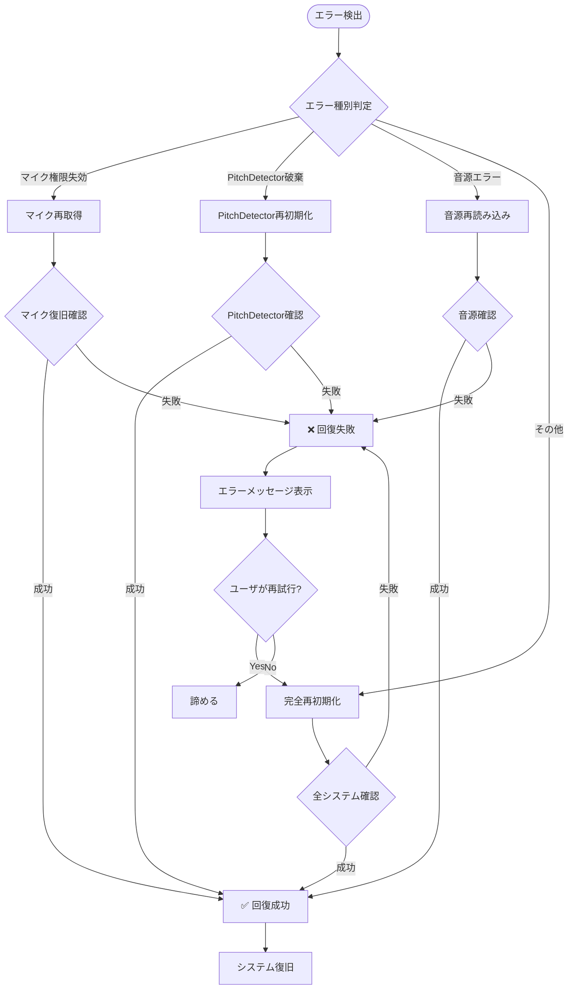
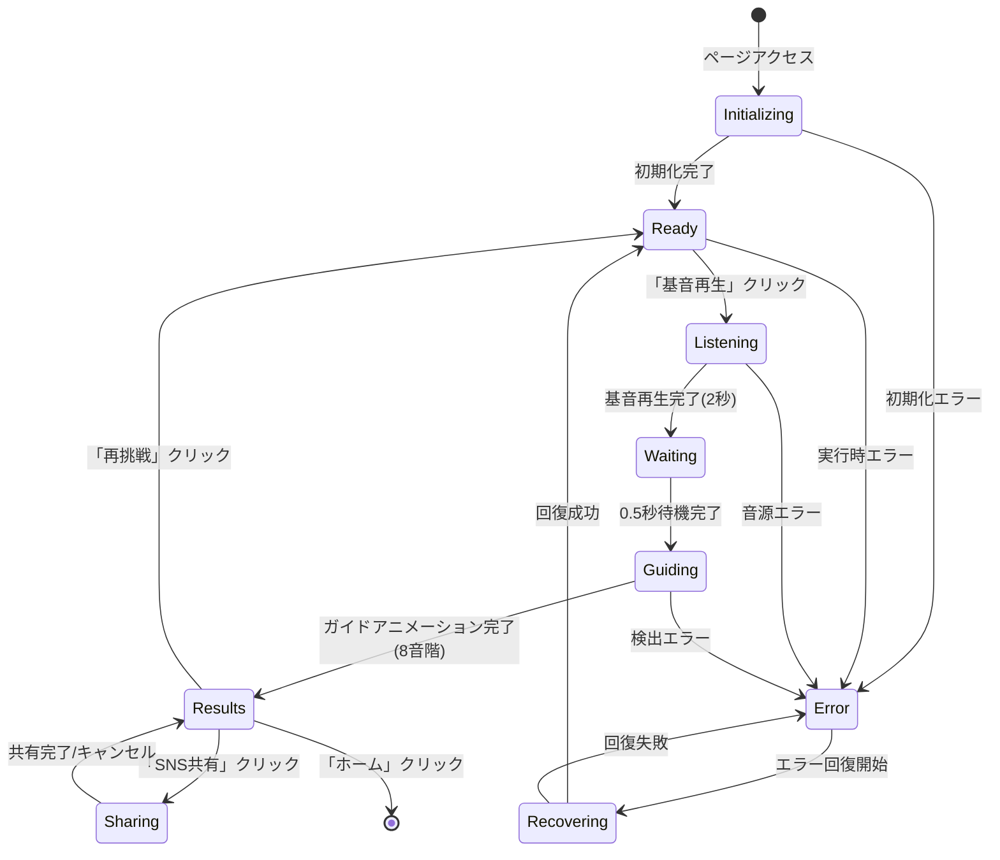
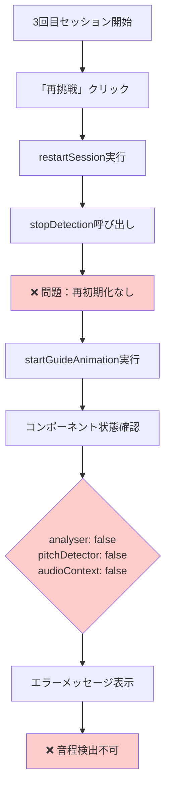
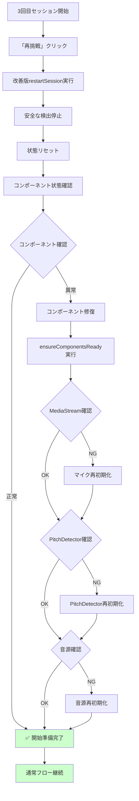
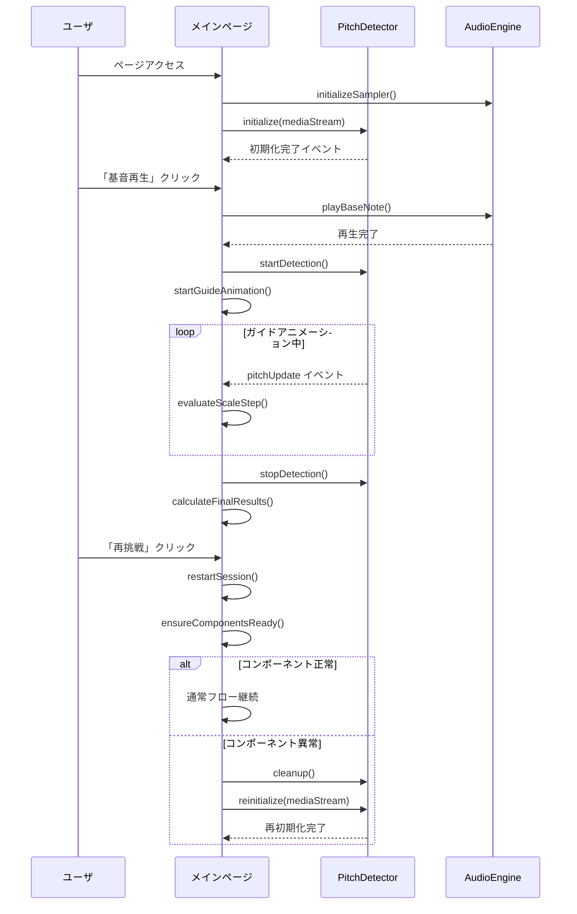
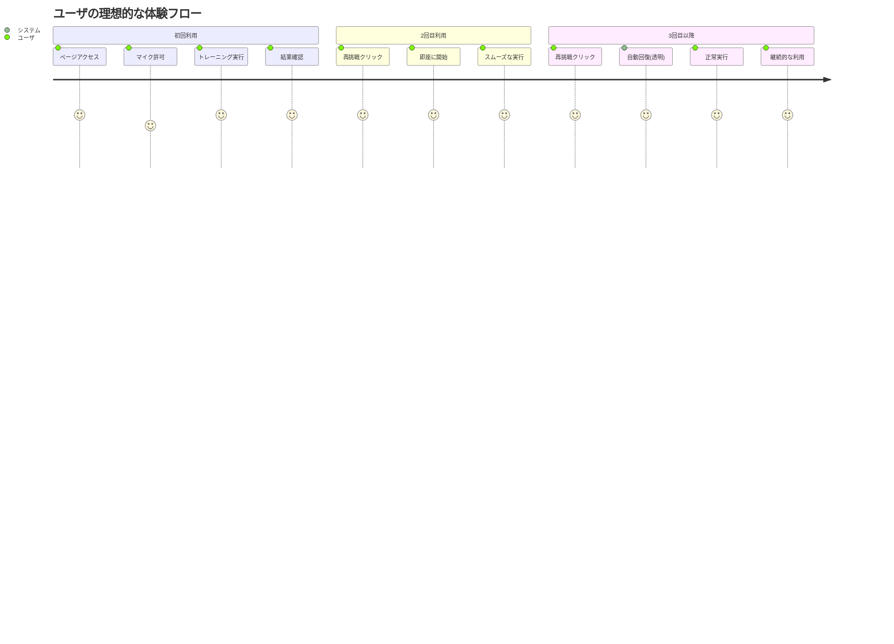

# ランダム基音トレーニング ユーザアクションフロー図

**作成日**: 2025-07-26  
**対象**: SvelteKit版ランダム基音トレーニング機能  
**目的**: ユーザ操作とシステム応答の可視化

---

## 🎯 正常フロー図

### **メインフロー: 初回セッション**

### **サブフロー: エラー回復**

---

## 🔄 状態遷移図

### **システム状態とユーザアクション**

---

## 🎭 詳細ユーザインタラクション

### **1. 初期アクセス時**

| ユーザアクション | システム応答 | 表示内容 | 内部処理 |
|-----------------|-------------|----------|----------|
| ページアクセス | 初期化開始 | "🎵 音源読み込み中..." | `initializeSystem()` |
| - | マイク許可確認 | 許可ダイアログ | `checkMicrophonePermission()` |
| マイク許可 | 初期化完了 | "🎤 トレーニング開始可能" | `pitchDetectorState = 'ready'` |
| マイク拒否 | エラー画面 | マイクテストページ誘導 | `microphoneState = 'denied'` |

### **2. トレーニング実行時**

| ユーザアクション | システム応答 | 表示内容 | 内部処理 |
|-----------------|-------------|----------|----------|
| 「基音再生」クリック | 基音選択・再生 | "🎵 基音再生中..." | `playBaseNote()` |
| - | 2秒待機 | 基音情報表示 | `sampler.triggerAttackRelease()` |
| - | ガイド開始 | "🎙️ ガイドに合わせて..." | `startGuideAnimation()` |
| ドレミ発声 | リアルタイム検出 | 周波数・音程表示 | `evaluateScaleStep()` |
| 8音階完了 | 結果計算 | "🎉 採点結果" | `calculateFinalResults()` |

### **3. 結果画面時**

| ユーザアクション | システム応答 | 表示内容 | 内部処理 |
|-----------------|-------------|----------|----------|
| 結果確認 | データ表示 | スコア・詳細結果 | `getDisplayEvaluations()` |
| 「再挑戦」クリック | セッションリセット | "🔄 準備中..." | `restartSession()` |
| 「SNS共有」クリック | 共有ダイアログ | 共有オプション | `generateShareText()` |
| 「ホーム」クリック | ページ遷移 | - | `goHome()` |

---

## 🚨 エラーケース詳細フロー

### **Case 1: 3回目セッション失敗（現在の問題）**

### **Case 2: 修正後の正常フロー**

---

## 🔍 コンポーネント間通信フロー

### **PitchDetectorコンポーネントとの連携**

---

## 📊 ユーザビリティ観点の改善点

### **現在の問題点**

| 問題 | ユーザ体験への影響 | 改善案 |
|------|------------------|--------|
| 3回目以降失敗 | 「アプリが壊れた」印象 | 自動回復機能 |
| エラー原因不明 | 何をすべきか分からない | 明確なエラーメッセージ |
| 再初期化なし | 手動リロードが必要 | 自動修復機能 |
| 状態不一致 | 予期しない動作 | 状態一貫性チェック |

### **改善後のユーザ体験**

---

## ✅ フロー図による検証項目

### **正常フロー検証**
- [ ] 初回アクセスから結果表示まで
- [ ] 2回目再挑戦の動作
- [ ] 3回目以降の安定動作
- [ ] SNS共有機能の動作

### **エラーフロー検証**
- [ ] マイク権限拒否時の誘導
- [ ] 音源読み込み失敗時の回復
- [ ] PitchDetector破棄時の自動修復
- [ ] 完全再初期化の動作

### **ユーザビリティ検証**
- [ ] 各状態での適切な表示
- [ ] ローディング状態の明確性
- [ ] エラーメッセージの分かりやすさ
- [ ] 回復処理の透明性

---

**このフロー図により、ユーザの操作とシステムの応答を可視化し、問題点と改善点を明確にしました。**