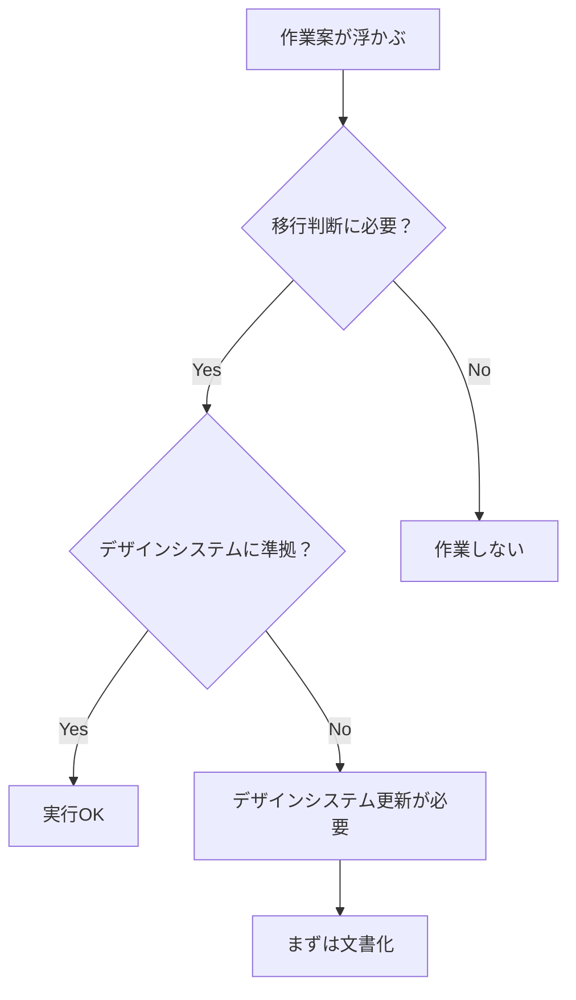

# Svelte移行プロジェクト - 日次チェックリスト

最終更新: 2025-01-25  
目的: プロジェクトの目的を見失わないための毎日の確認事項

## 🌅 開発開始時に必ず確認すること

### **📋 基本確認（毎回必須）**
- [ ] **SVELTE_DEVELOPMENT_STATUS.md** を読んで現在の状況を把握
- [ ] **SVELTE_MIGRATION_CHARTER.md** でプロジェクトの目的を再確認
- [ ] 今日の作業が移行の目的に沿っているかを確認
- [ ] 禁止事項リストを確認（不要な作業を避ける）

### **🚨 重要な質問（自問自答）**
1. **なぜSvelte移行を検討しているのか？**
   - → Next.js/Reactと音響処理の相性が悪いから
   
2. **今やろうとしている作業は移行判断に必要か？**
   - → 必要でない場合は作業を中止
   
3. **勝手にNext.js開発を始めていないか？**
   - → CLAUDE.mdの警告を思い出す

### **📅 現在のフェーズ確認**
```
現在: Phase 1 (プロトタイプ検証)
期限: 2025-02-03
次の判断: GO/NO-GO決定
```

## 🎯 作業前チェック

### **実施可能な作業**
- ✅ Svelteプロトタイプの作成
- ✅ パフォーマンス測定
- ✅ 移行関連文書の更新
- ✅ 音響処理モジュールの分離

### **保留中の作業**
- ⏸️ Next.jsでの新機能開発
- ⏸️ 既存ページの大幅変更
- ⏸️ 新しいライブラリの導入

### **禁止されている作業**
- ❌ shadcn/uiの再試行
- ❌ 新規ページの追加
- ❌ アーキテクチャの変更

## 💡 作業中の判断基準

### **迷った時の判断フロー**


### **技術的判断基準**
- **パフォーマンス**: 60fps維持に寄与するか？
- **統一性**: デザインシステムに準拠するか？
- **移行**: Svelte移行の判断材料になるか？

## 📊 進捗確認

### **毎日確認すべき指標**
- [ ] プロトタイプの進捗率: ___% 
- [ ] パフォーマンス測定の完了: [ ] 未 [ ] 済
- [ ] 判断基準の達成状況:
  - [ ] 60fps維持
  - [ ] バンドルサイズ50%削減
  - [ ] 開発体験向上
  - [ ] スタイリング問題解決

### **週次確認事項**
- [ ] 移行スケジュールの遵守
- [ ] リスクの早期発見
- [ ] 判断基準の見直し必要性

## 🚨 危険信号

### **こんな状況は要注意**
- ❌ Next.jsの新機能を実装し始めた
- ❌ 「とりあえず」でshadcn/uiを使おうとした
- ❌ プロトタイプ以外のコードを書いている
- ❌ 移行の目的があいまいになってきた

### **危険信号を察知したら**
1. **即座に作業停止**
2. **SVELTE_MIGRATION_CHARTER.md** を再読
3. **現在のフェーズと目的を確認**
4. **ユーザーに状況報告**

## 🔄 終業時チェック

### **今日の作業記録**
- [ ] **SVELTE_DEVELOPMENT_STATUS.md** を更新
- [ ] 進捗をToDoリストに反映
- [ ] 明日の作業予定を明確化
- [ ] 発見した問題やリスクを記録

### **明日への引き継ぎ**
```
今日の達成: 
今日の課題: 
明日の予定: 
注意事項: 
```

## 📚 重要文書へのクイックアクセス

### **必読文書**
1. **[SVELTE_MIGRATION_CHARTER.md](./SVELTE_MIGRATION_CHARTER.md)** - プロジェクトの目的
2. **[SVELTE_DEVELOPMENT_STATUS.md](./SVELTE_DEVELOPMENT_STATUS.md)** - 現在の状況
3. **[SVELTE_MIGRATION_PLAN.md](./SVELTE_MIGRATION_PLAN.md)** - 移行計画
4. **[SVELTE_DESIGN_SYSTEM_SPEC.md](./SVELTE_DESIGN_SYSTEM_SPEC.md)** - デザイン仕様

### **参考文書**
- [ADR-001-SVELTE-MIGRATION.md](./ADR-001-SVELTE-MIGRATION.md) - 移行決定の背景
- [ADR-002-SVELTE-DESIGN-SYSTEM.md](./ADR-002-SVELTE-DESIGN-SYSTEM.md) - デザインシステム決定

## ⏰ タイムボックス

### **作業時間の目安**
- **文書確認**: 5分
- **状況把握**: 10分
- **作業計画**: 5分
- **実際の作業**: メイン時間
- **進捗記録**: 10分

### **重要な期限**
- **2025-02-01**: プロトタイプ完成期限
- **2025-02-03**: GO/NO-GO判断日
- **毎日**: このチェックリストの実行

---

**このチェックリストは、プロジェクトの成功を保証する日々の習慣です。**  
**必ず毎日実行し、目的を見失わないようにしてください。**