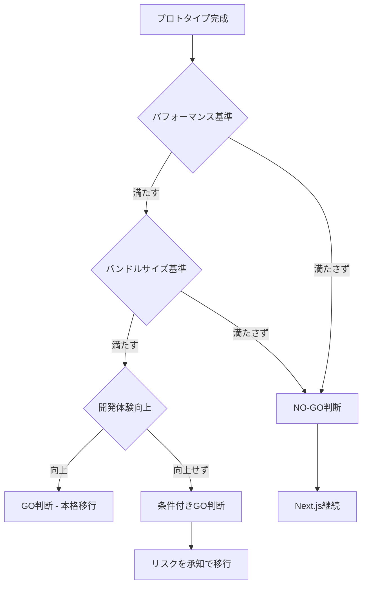

# Svelte移行計画書

作成日: 2025-01-25  
最終更新: 2025-01-25  
ステータス: **実行準備中**

## 🎯 移行の目的

### **解決すべき問題**
1. **パフォーマンス**: 音量バー等の高頻度更新でフレームドロップ
2. **スタイリング**: shadcn/uiがプロダクションで動作しない
3. **保守性**: 各ページ異なる実装方式で統一性なし
4. **開発体験**: ReactとDOM操作の競合による複雑化

### **期待される成果**
1. **60fps維持**: リアルタイム音響UIの滑らかな動作
2. **バンドル削減**: 50%以上のサイズ削減
3. **統一実装**: 全ページで一貫したコード品質
4. **開発効率**: より直感的で高速な開発

## 📅 段階的移行スケジュール

### **Phase 1: プロトタイプ検証（2025-01-25 〜 2025-02-01）**

#### **Week 1: 環境構築（1月25日-26日）**
- [ ] Svelteプロジェクト初期化
- [ ] 音響処理モジュールの分離
- [ ] 開発環境の構築

#### **Week 2: マイクテスト実装（1月27日-31日）**
- [ ] マイクテストページのSvelte版作成
- [ ] パフォーマンス測定
- [ ] Next.js版との比較

#### **Week 3: 評価（2月1日-3日）**
- [ ] GO/NO-GO判断
- [ ] 結果レポート作成

### **Phase 2: 本格移行（GO判断の場合のみ）**

#### **Week 4-5: コア機能移行（2月4日-14日）**
- [ ] ランダムモードページ
- [ ] デザインシステム確立
- [ ] 共通コンポーネント作成

#### **Week 6-7: 完全移行（2月15日-28日）**
- [ ] 全ページ移行
- [ ] テスト・デバッグ
- [ ] 最適化

## 🏗️ 技術アーキテクチャ

### **ディレクトリ構造（提案）**
```
pitch-training/
├── nextjs/                    # 現行版（保持）
│   └── src/
├── svelte/                    # 新版
│   ├── src/
│   │   ├── routes/            # SvelteKitページ
│   │   ├── lib/
│   │   │   ├── components/    # UIコンポーネント
│   │   │   └── audio/         # 音響処理（共通）
│   │   └── app.html
│   ├── package.json
│   └── svelte.config.js
└── shared/                    # 共通モジュール
    └── audio-core/            # 音響処理コア
```

### **依存関係戦略**
```json
{
  "dependencies": {
    "@sveltejs/kit": "^2.0.0",
    "svelte": "^4.0.0",
    "tone": "^14.7.0",           // 音源（継続使用）
    "pitchy": "^4.0.0"          // 音程検出（継続使用）
  },
  "devDependencies": {
    "tailwindcss": "^3.0.0",    // スタイリング
    "vite": "^5.0.0"            // ビルドツール
  }
}
```

## 📊 判断基準

### **定量的基準**

| 項目 | 現在（Next.js） | 目標（Svelte） | 測定方法 |
|------|-----------------|----------------|----------|
| バンドルサイズ | ~200KB | <100KB | webpack-bundle-analyzer |
| 音量バー更新 | ~30fps | 60fps | Chrome DevTools |
| 初回読み込み | ~2s | <1s | Lighthouse |
| メモリ使用量 | ~15MB | <10MB | Chrome Task Manager |

### **定性的基準**
- [ ] **開発体験**: より直感的なコード記述
- [ ] **デバッグ**: 問題の特定が容易
- [ ] **スタイリング**: 確実に動作するCSS
- [ ] **保守性**: 統一されたコード品質

## 🚦 判断フロー



## ⚠️ リスク管理

### **技術的リスク**
| リスク | 影響度 | 対策 |
|--------|--------|------|
| Svelteエコシステム不足 | 中 | 必要な機能の事前検証 |
| 移行期間の長期化 | 高 | 明確な判断基準設定 |
| 未知の不具合 | 中 | 段階的移行、十分なテスト |

### **ビジネスリスク**
| リスク | 影響度 | 対策 |
|--------|--------|------|
| 開発停止期間 | 低 | 並行開発でリスク最小化 |
| 品質低下 | 高 | プロトタイプでの十分な検証 |

## 🔄 ロールバック計画

### **NO-GO判断時**
1. Svelteブランチの削除
2. Next.js版での開発再開
3. 代替改善案の検討

### **移行途中での問題発生時**
1. 即座にNext.js版に復帰
2. 問題の分析とレポート作成
3. 移行計画の見直し

## 📋 チェックリスト

### **移行開始前**
- [ ] SVELTE_MIGRATION_CHARTER.mdの確認
- [ ] SVELTE_DESIGN_SYSTEM_SPEC.mdの完成
- [ ] 音響処理モジュールの分離完了
- [ ] テスト基準の策定

### **プロトタイプ完成時**
- [ ] パフォーマンス測定完了
- [ ] バンドルサイズ比較完了
- [ ] 機能動作確認完了
- [ ] ユーザビリティテスト完了

### **GO判断時**
- [ ] すべての定量的基準をクリア
- [ ] 開発体験の向上を確認
- [ ] リスクを許容可能と判断
- [ ] スケジュールに問題なし

---

**この計画書は、移行の成功を保証するための詳細な指針です。**  
**すべての判断は、この計画に基づいて実行されます。**