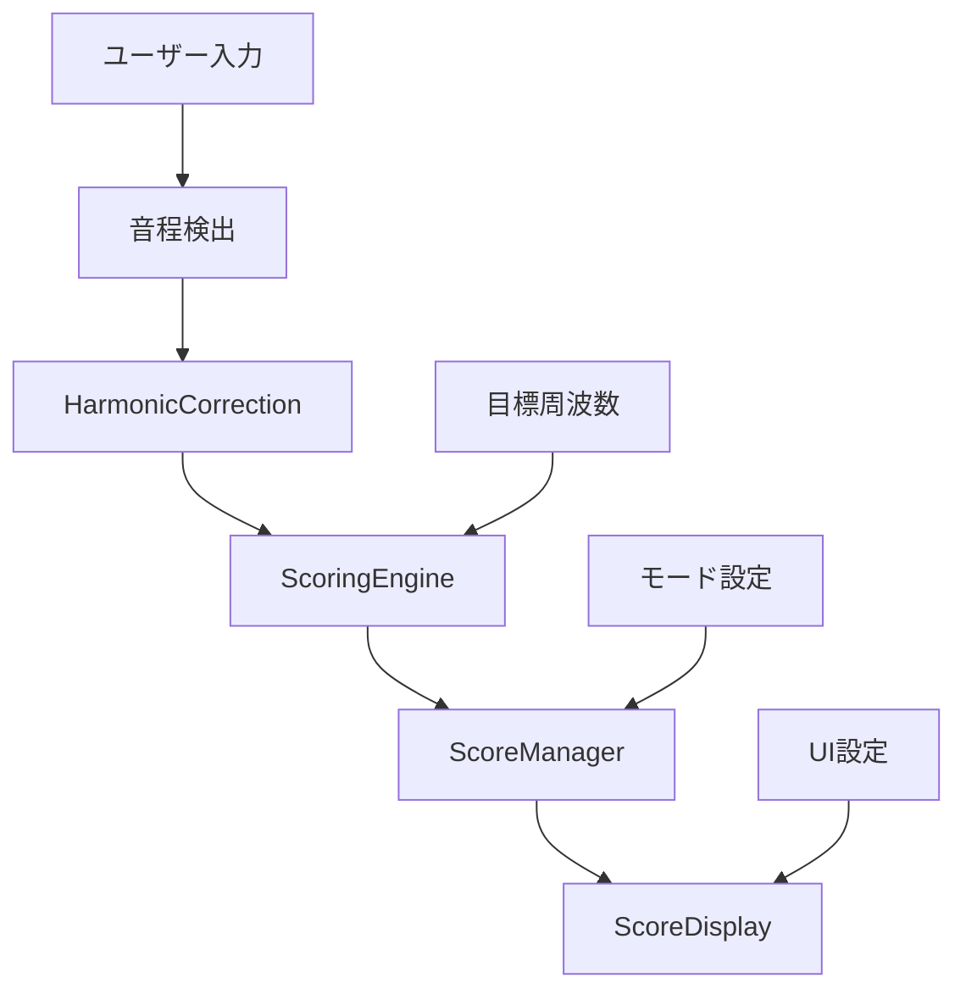

# 統一採点システム仕様書 (Unified Scoring System Specification)

**作成日**: 2025-07-28  
**対象**: Random / Continuous / Chromatic モード統一採点システム  
**技術基盤**: SvelteKit + HarmonicCorrection + 統一音響処理システム  
**作業ディレクトリ**: `/Users/isao/Documents/pitch-training`

---

## 📋 **概要・目標**

### **システム目的**
3つのトレーニングモードで完全に統一された高精度採点システムを構築し、ユーザーに一貫した学習体験を提供する。

### **対象モード**
- **Random Mode**: 短音採点 + 総合評価表示
- **Continuous Mode**: 5回分採点保持 + 総合評価  
- **Chromatic Mode**: 12音上下採点保持 + 総合評価

### **技術的目標**
- ✅ **HarmonicCorrection活用**: 既存の高精度倍音補正システム統合
- ✅ **コード重複削減**: 共通エンジンによる統一実装
- ✅ **保守性向上**: 中央集権的な採点ロジック管理
- ✅ **拡張性確保**: 将来の新モード・機能追加への対応

---

## 🧠 **アーキテクチャ設計**

### **1. 採点システム全体構成**
```
採点システム階層構造
├── ScoringEngine.js         # 統一採点エンジン（コア）
├── ScoreManager.js          # モード別スコア管理
├── ScoreDisplay.svelte      # 共通表示コンポーネント
└── 既存システム統合
    ├── HarmonicCorrection   # 高精度倍音補正
    ├── PitchDetectionDisplay # 音程検出表示
    └── UnifiedAudioProcessor # 音響処理
```

### **2. データフロー設計**


---

## 🎯 **ScoringEngine.js 詳細仕様**

### **基本クラス構造**
```javascript
/**
 * ScoringEngine - 3モード統一採点エンジン
 * 
 * 特徴:
 * - HarmonicCorrection統合による高精度補正
 * - モード別設定によるカスタマイズ
 * - セント差ベースの音楽的評価
 * - 反応時間スコア統合
 */
class ScoringEngine {
  constructor(mode, config = {}) {
    // モード識別
    this.mode = mode; // 'random' | 'continuous' | 'chromatic'
    
    // 既存システム統合
    this.harmonicCorrection = harmonicCorrection; // 既存インスタンス活用
    
    // モード別設定
    this.config = {
      ...this.getDefaultConfig(),
      ...this.getModeConfig(mode),
      ...config
    };
    
    // 採点履歴
    this.scoreHistory = [];
    this.sessionStats = this.initializeSessionStats();
    
    // デバッグモード（開発時のみ）
    this.debugMode = import.meta.env.DEV;
    
    this.log('🎯 ScoringEngine初期化完了', { mode, config: this.config });
  }
  
  /**
   * メイン採点処理
   * @param {Object} input - 採点入力データ
   * @returns {Object} - 包括的採点結果
   */
  calculateScore(input) {
    const {
      detectedFrequency,
      targetFrequency,
      responseTime,
      contextData = {}
    } = input;
    
    // 1. HarmonicCorrectionによる高精度補正
    const correctedFreq = this.harmonicCorrection.correctHarmonic(
      detectedFrequency,
      this.debugMode // デバッグログ有効化
    );
    
    // 2. セント差計算（音楽的評価の基準）
    const centsDiff = this.calculateCentsDifference(correctedFreq, targetFrequency);
    
    // 3. 精度スコア計算（100点満点）
    const accuracyScore = this.calculateAccuracyScore(centsDiff);
    
    // 4. 反応時間スコア計算
    const timeScore = this.calculateTimeScore(responseTime);
    
    // 5. 総合スコア計算（重み付け）
    const totalScore = this.calculateTotalScore(accuracyScore, timeScore);
    
    // 6. 評価ランク判定
    const rank = this.determineRank(totalScore, accuracyScore);
    
    // 7. 結果オブジェクト構築
    const result = {
      // 基本スコア
      accuracyScore: Math.round(accuracyScore * 10) / 10,
      timeScore: Math.round(timeScore * 10) / 10,
      totalScore: Math.round(totalScore * 10) / 10,
      
      // 詳細情報
      centsDiff: Math.round(centsDiff * 10) / 10,
      correctedFrequency: Math.round(correctedFreq * 10) / 10,
      originalFrequency: Math.round(detectedFrequency * 10) / 10,
      targetFrequency: Math.round(targetFrequency * 10) / 10,
      responseTime,
      
      // 評価
      rank,
      feedback: this.generateFeedback(centsDiff, responseTime, rank),
      
      // コンテキスト
      mode: this.mode,
      timestamp: Date.now(),
      ...contextData
    };
    
    // 8. 履歴記録・統計更新
    this.recordScore(result);
    
    // 9. デバッグログ出力
    if (this.debugMode) {
      this.logScoringDetails(result);
    }
    
    return result;
  }
  
  /**
   * セント差計算
   * @param {number} detected - 検出周波数
   * @param {number} target - 目標周波数
   * @returns {number} - セント差（±1200セント範囲）
   */
  calculateCentsDifference(detected, target) {
    if (!detected || !target || detected <= 0 || target <= 0) {
      return 0;
    }
    
    const cents = 1200 * Math.log2(detected / target);
    
    // オクターブ範囲制限（±600セント = ±半オクターブ）
    const clampedCents = Math.max(-600, Math.min(600, cents));
    
    return clampedCents;
  }
  
  /**
   * 精度スコア計算
   * @param {number} centsDiff - セント差
   * @returns {number} - 精度スコア (0-100)
   */
  calculateAccuracyScore(centsDiff) {
    const absCents = Math.abs(centsDiff);
    
    // セント差による精度評価
    // 0-10セント: 100点, 50セント: 80点, 100セント: 60点, 200セント: 0点
    const baseScore = Math.max(0, 100 - (absCents / this.config.scoring.centsPenalty));
    
    return Math.min(100, baseScore);
  }
  
  /**
   * 反応時間スコア計算
   * @param {number} responseTime - 反応時間（ミリ秒）
   * @returns {number} - 時間スコア (0-100)
   */
  calculateTimeScore(responseTime) {
    if (!responseTime || responseTime <= 0) {
      return 50; // 中性値
    }
    
    const seconds = responseTime / 1000;
    const { optimal, penalty } = this.config.timing;
    
    // 最適時間からの乖離に基づくスコア
    const timeScore = Math.max(0, 100 - Math.abs(seconds - optimal) * penalty);
    
    return Math.min(100, timeScore);
  }
  
  /**
   * 総合スコア計算
   * @param {number} accuracyScore - 精度スコア
   * @param {number} timeScore - 時間スコア
   * @returns {number} - 総合スコア (0-100)
   */
  calculateTotalScore(accuracyScore, timeScore) {
    const { accuracyWeight, timeWeight } = this.config.scoring;
    
    return (accuracyScore * accuracyWeight) + (timeScore * timeWeight);
  }
  
  /**
   * 評価ランク判定
   * @param {number} totalScore - 総合スコア
   * @param {number} accuracyScore - 精度スコア
   * @returns {Object} - ランク情報
   */
  determineRank(totalScore, accuracyScore) {
    const { ranks } = this.config.evaluation;
    
    // 精度優先の判定ロジック
    if (accuracyScore >= 95) return ranks.perfect;
    if (accuracyScore >= 85 && totalScore >= 90) return ranks.excellent;
    if (accuracyScore >= 75 && totalScore >= 80) return ranks.good;
    if (accuracyScore >= 60 && totalScore >= 70) return ranks.fair;
    if (accuracyScore >= 40) return ranks.poor;
    
    return ranks.miss;
  }
  
  /**
   * フィードバック生成
   * @param {number} centsDiff - セント差
   * @param {number} responseTime - 反応時間
   * @param {Object} rank - ランク情報
   * @returns {string} - ユーザー向けフィードバック
   */
  generateFeedback(centsDiff, responseTime, rank) {
    const { feedback } = this.config.evaluation;
    
    // 基本フィードバック
    let message = rank.message;
    
    // 詳細フィードバック追加
    if (Math.abs(centsDiff) <= 10) {
      message += feedback.accuracy.perfect;
    } else if (Math.abs(centsDiff) <= 50) {
      message += feedback.accuracy.good;
    } else {
      const direction = centsDiff > 0 ? feedback.pitch.high : feedback.pitch.low;
      message += direction;
    }
    
    // 反応時間フィードバック
    const seconds = responseTime / 1000;
    if (seconds <= 2) {
      message += feedback.timing.fast;
    } else if (seconds >= 5) {
      message += feedback.timing.slow;
    }
    
    return message;
  }
  
  /**
   * スコア記録・統計更新
   * @param {Object} result - 採点結果
   */
  recordScore(result) {
    // 履歴追加
    this.scoreHistory.push(result);
    
    // モード別履歴管理
    if (this.scoreHistory.length > this.config.session.maxHistory) {
      this.scoreHistory.shift();
    }
    
    // 統計更新
    this.updateSessionStats(result);
  }
  
  /**
   * セッション統計更新
   * @param {Object} result - 採点結果
   */
  updateSessionStats(result) {
    const stats = this.sessionStats;
    
    stats.totalAttempts++;
    stats.totalScore += result.totalScore;
    stats.totalAccuracy += result.accuracyScore;
    stats.totalTime += result.responseTime;
    
    // 平均計算
    stats.averageScore = stats.totalScore / stats.totalAttempts;
    stats.averageAccuracy = stats.totalAccuracy / stats.totalAttempts;
    stats.averageTime = stats.totalTime / stats.totalAttempts;
    
    // ベストスコア更新
    if (result.totalScore > stats.bestScore) {
      stats.bestScore = result.totalScore;
      stats.bestResult = { ...result };
    }
    
    // ランク別カウント
    const rankKey = result.rank.level;
    stats.rankCounts[rankKey] = (stats.rankCounts[rankKey] || 0) + 1;
    
    // 最後の更新時刻
    stats.lastUpdated = Date.now();
  }
  
  /**
   * モード別デフォルト設定
   * @param {string} mode - モード識別子
   * @returns {Object} - モード別設定
   */
  getModeConfig(mode) {
    const modeConfigs = {
      random: {
        scoring: {
          accuracyWeight: 0.7,      // 精度重視
          timeWeight: 0.3,
          centsPenalty: 2.0         // 1セントあたり2点減点
        },
        timing: {
          optimal: 3.0,             // 3秒が最適
          penalty: 10               // 1秒あたり10点減点
        },
        session: {
          maxHistory: 10,           // 最大10回分保持
          showProgress: true
        }
      },
      
      continuous: {
        scoring: {
          accuracyWeight: 0.8,      // より精度重視
          timeWeight: 0.2,
          centsPenalty: 1.5         // ややペナルティ軽減
        },
        timing: {
          optimal: 2.5,             // より速い反応を要求
          penalty: 15               // 時間ペナルティ強化
        },
        session: {
          maxHistory: 5,            // 5回分のみ保持
          showProgress: true,
          requireConsistency: true  // 一貫性評価
        }
      },
      
      chromatic: {
        scoring: {
          accuracyWeight: 0.9,      // 最高精度要求
          timeWeight: 0.1,
          centsPenalty: 1.0         // 最小ペナルティ
        },
        timing: {
          optimal: 4.0,             // 時間に余裕
          penalty: 5                // 時間ペナルティ最小
        },
        session: {
          maxHistory: 24,           // 12音×上下=24回分
          showProgress: true,
          showMatrix: true          // マトリックス表示
        }
      }
    };
    
    return modeConfigs[mode] || modeConfigs.random;
  }
  
  /**
   * 共通デフォルト設定
   * @returns {Object} - デフォルト設定
   */
  getDefaultConfig() {
    return {
      evaluation: {
        ranks: {
          perfect: { level: 'perfect', message: '🎯 完璧!', color: '#10b981', threshold: 95 },
          excellent: { level: 'excellent', message: '✨ 素晴らしい!', color: '#059669', threshold: 85 },
          good: { level: 'good', message: '👍 良好', color: '#3b82f6', threshold: 75 },
          fair: { level: 'fair', message: '📈 もう少し', color: '#f59e0b', threshold: 60 },
          poor: { level: 'poor', message: '🔄 練習しよう', color: '#ef4444', threshold: 40 },
          miss: { level: 'miss', message: '❌ 再挑戦', color: '#dc2626', threshold: 0 }
        },
        feedback: {
          accuracy: {
            perfect: ' 音程が完璧です！',
            good: ' 良い精度です',
            need_improvement: ' 音程を調整してみてください'
          },
          pitch: {
            high: ' 少し高めです',
            low: ' 少し低めです'
          },
          timing: {
            fast: ' 反応が早いです！',
            slow: ' もう少し早く歌ってみてください'
          }
        }
      },
      debug: {
        logScoring: import.meta.env.DEV,
        logHarmonic: import.meta.env.DEV
      }
    };
  }
  
  /**
   * セッション統計初期化
   * @returns {Object} - 初期統計オブジェクト
   */
  initializeSessionStats() {
    return {
      totalAttempts: 0,
      totalScore: 0,
      totalAccuracy: 0,
      totalTime: 0,
      averageScore: 0,
      averageAccuracy: 0,
      averageTime: 0,
      bestScore: 0,
      bestResult: null,
      rankCounts: {},
      startTime: Date.now(),
      lastUpdated: Date.now()
    };
  }
  
  /**
   * 現在の統計取得
   * @returns {Object} - セッション統計
   */
  getSessionStats() {
    return { ...this.sessionStats };
  }
  
  /**
   * 履歴取得
   * @param {number} limit - 取得件数制限
   * @returns {Array} - スコア履歴
   */
  getScoreHistory(limit = null) {
    if (limit) {
      return this.scoreHistory.slice(-limit);
    }
    return [...this.scoreHistory];
  }
  
  /**
   * 統計リセット
   */
  resetStats() {
    this.scoreHistory = [];
    this.sessionStats = this.initializeSessionStats();
    this.harmonicCorrection.resetHistory(); // 倍音補正履歴もリセット
    
    this.log('📊 統計リセット完了');
  }
  
  /**
   * デバッグログ出力
   * @param {string} message - ログメッセージ
   * @param {Object} data - 追加データ
   */
  log(message, data = null) {
    if (this.debugMode) {
      if (data) {
        console.log(`[ScoringEngine] ${message}`, data);
      } else {
        console.log(`[ScoringEngine] ${message}`);
      }
    }
  }
  
  /**
   * 詳細採点ログ出力
   * @param {Object} result - 採点結果
   */
  logScoringDetails(result) {
    console.group(`🎯 [ScoringEngine] ${this.mode.toUpperCase()}モード採点結果`);
    
    console.log('📊 スコア詳細:', {
      総合: `${result.totalScore}点`,
      精度: `${result.accuracyScore}点 (${result.centsDiff > 0 ? '+' : ''}${result.centsDiff}セント)`,
      時間: `${result.timeScore}点 (${result.responseTime}ms)`,
      ランク: `${result.rank.level} - ${result.rank.message}`
    });
    
    console.log('🔧 周波数詳細:', {
      検出: `${result.originalFrequency}Hz`,
      補正後: `${result.correctedFrequency}Hz`,
      目標: `${result.targetFrequency}Hz`,
      補正効果: `${Math.abs(result.correctedFrequency - result.originalFrequency) > 1 ? '有効' : '無し'}`
    });
    
    console.log('💬 フィードバック:', result.feedback);
    
    console.groupEnd();
  }
}
```

---

## 📊 **ScoreManager.js モード別管理仕様**

### **基本クラス構造**
```javascript
/**
 * BaseScoreManager - 共通スコア管理基底クラス
 */
class BaseScoreManager {
  constructor(scoringEngine) {
    this.scoringEngine = scoringEngine;
    this.scores = [];
    this.displayState = 'waiting'; // 'waiting' | 'active' | 'completed'
  }
  
  addScore(scoreData) {
    const result = this.scoringEngine.calculateScore(scoreData);
    this.scores.push(result);
    this.onScoreAdded(result);
    return result;
  }
  
  // サブクラスでオーバーライド
  onScoreAdded(result) {}
  getDisplayData() {}
  reset() {}
}

/**
 * RandomScoreManager - ランダムモード専用
 */
class RandomScoreManager extends BaseScoreManager {
  constructor(scoringEngine) {
    super(scoringEngine);
    this.currentScore = null;
    this.sessionStats = {
      attempts: 0,
      averageScore: 0,
      bestScore: 0,
      rankDistribution: {}
    };
  }
  
  onScoreAdded(result) {
    this.currentScore = result;
    this.updateSessionStats(result);
    
    // 即座表示設定
    this.displayState = 'active';
    
    // 3秒後に次の準備
    setTimeout(() => {
      this.displayState = 'waiting';
    }, 3000);
  }
  
  getDisplayData() {
    return {
      mode: 'random',
      currentScore: this.currentScore,
      sessionStats: this.sessionStats,
      displayState: this.displayState,
      showImmediate: true
    };
  }
  
  updateSessionStats(result) {
    this.sessionStats.attempts++;
    this.sessionStats.averageScore = 
      (this.sessionStats.averageScore * (this.sessionStats.attempts - 1) + result.totalScore) 
      / this.sessionStats.attempts;
    
    if (result.totalScore > this.sessionStats.bestScore) {
      this.sessionStats.bestScore = result.totalScore;
    }
    
    const rank = result.rank.level;
    this.sessionStats.rankDistribution[rank] = 
      (this.sessionStats.rankDistribution[rank] || 0) + 1;
  }
  
  reset() {
    this.currentScore = null;
    this.displayState = 'waiting';
    this.sessionStats = {
      attempts: 0,
      averageScore: 0,
      bestScore: 0,
      rankDistribution: {}
    };
  }
}

/**
 * ContinuousScoreManager - 連続チャレンジモード専用
 */
class ContinuousScoreManager extends BaseScoreManager {
  constructor(scoringEngine, maxAttempts = 5) {
    super(scoringEngine);
    this.maxAttempts = maxAttempts;
    this.currentAttempt = 0;
    this.challengeScores = [];
    this.challengeComplete = false;
  }
  
  onScoreAdded(result) {
    this.challengeScores.push(result);
    this.currentAttempt++;
    
    if (this.currentAttempt >= this.maxAttempts) {
      this.challengeComplete = true;
      this.displayState = 'completed';
    } else {
      this.displayState = 'active';
    }
  }
  
  getDisplayData() {
    const totalScore = this.challengeScores.reduce((sum, score) => sum + score.totalScore, 0);
    const averageScore = this.challengeScores.length > 0 ? totalScore / this.challengeScores.length : 0;
    
    return {
      mode: 'continuous',
      attempts: this.challengeScores,
      currentAttempt: this.currentAttempt,
      maxAttempts: this.maxAttempts,
      totalScore,
      averageScore,
      challengeComplete: this.challengeComplete,
      displayState: this.displayState,
      progress: (this.currentAttempt / this.maxAttempts) * 100
    };
  }
  
  reset() {
    this.currentAttempt = 0;
    this.challengeScores = [];
    this.challengeComplete = false;
    this.displayState = 'waiting';
  }
}

/**
 * ChromaticScoreManager - 12音階モード専用
 */
class ChromaticScoreManager extends BaseScoreManager {
  constructor(scoringEngine) {
    super(scoringEngine);
    this.chromaticMatrix = new Map(); // 'note_direction' => score
    this.completedNotes = new Set();
    this.totalTargets = 24; // 12音 × 上下
  }
  
  onScoreAdded(result, noteInfo) {
    const { note, direction } = noteInfo; // 'C4', 'up'/'down'
    const key = `${note}_${direction}`;
    
    this.chromaticMatrix.set(key, result);
    this.completedNotes.add(key);
    
    if (this.completedNotes.size >= this.totalTargets) {
      this.displayState = 'completed';
    } else {
      this.displayState = 'active';
    }
  }
  
  getDisplayData() {
    const scores = Array.from(this.chromaticMatrix.values());
    const totalScore = scores.reduce((sum, score) => sum + score.totalScore, 0);
    const averageScore = scores.length > 0 ? totalScore / scores.length : 0;
    
    // 12音階マトリックス生成
    const notes = ['C', 'C#', 'D', 'D#', 'E', 'F', 'F#', 'G', 'G#', 'A', 'A#', 'B'];
    const matrix = notes.map(note => ({
      note,
      up: this.chromaticMatrix.get(`${note}_up`) || null,
      down: this.chromaticMatrix.get(`${note}_down`) || null
    }));
    
    return {
      mode: 'chromatic',
      matrix,
      completedCount: this.completedNotes.size,
      totalTargets: this.totalTargets,
      totalScore,
      averageScore,
      displayState: this.displayState,
      progress: (this.completedNotes.size / this.totalTargets) * 100
    };
  }
  
  reset() {
    this.chromaticMatrix.clear();
    this.completedNotes.clear();
    this.displayState = 'waiting';
  }
}

/**
 * ScoreManagerFactory - ファクトリーパターン
 */
class ScoreManagerFactory {
  static create(mode, scoringEngine, options = {}) {
    switch (mode) {
      case 'random':
        return new RandomScoreManager(scoringEngine);
      case 'continuous':
        return new ContinuousScoreManager(scoringEngine, options.maxAttempts);
      case 'chromatic':
        return new ChromaticScoreManager(scoringEngine);
      default:
        throw new Error(`未対応モード: ${mode}`);
    }
  }
}
```

---

## 🎨 **ScoreDisplay.svelte 表示コンポーネント仕様**

### **メインコンポーネント**
```svelte
<!-- ScoreDisplay.svelte -->
<script>
  import SingleScoreDisplay from './SingleScoreDisplay.svelte';
  import ContinuousScoreDisplay from './ContinuousScoreDisplay.svelte';
  import ChromaticGridDisplay from './ChromaticGridDisplay.svelte';
  import OverallStatsDisplay from './OverallStatsDisplay.svelte';
  
  // Props
  export let mode; // 'random' | 'continuous' | 'chromatic'
  export let scoreData;
  export let className = '';
  export let showStats = true;
  export let showDetails = true;
  
  // モード別表示制御
  $: displayMode = getDisplayMode(mode, scoreData?.displayState);
  $: showComponent = scoreData && scoreData.displayState !== 'waiting';
</script>

{#if showComponent}
  <div class="score-display {className} mode-{mode}" data-mode={mode}>
    <!-- モード別メイン表示 -->
    <div class="score-main">
      {#if mode === 'random'}
        <SingleScoreDisplay {scoreData} {showDetails} />
      {:else if mode === 'continuous'}
        <ContinuousScoreDisplay {scoreData} {showDetails} />
      {:else if mode === 'chromatic'}
        <ChromaticGridDisplay {scoreData} {showDetails} />
      {/if}
    </div>
    
    <!-- 共通統計表示 -->
    {#if showStats && scoreData.sessionStats}
      <div class="score-stats">
        <OverallStatsDisplay 
          stats={scoreData.sessionStats} 
          {mode} 
        />
      </div>
    {/if}
  </div>
{/if}

<style>
  .score-display {
    @apply space-y-4;
  }
  
  .score-main {
    @apply bg-white rounded-lg shadow-sm border p-6;
  }
  
  .score-stats {
    @apply bg-gray-50 rounded-lg p-4;
  }
  
  /* モード別スタイル */
  .mode-random .score-main {
    @apply border-blue-200;
  }
  
  .mode-continuous .score-main {
    @apply border-green-200;
  }
  
  .mode-chromatic .score-main {
    @apply border-purple-200;
  }
  
  /* レスポンシブ対応 */
  @media (max-width: 768px) {
    .score-display {
      @apply space-y-3;
    }
    
    .score-main {
      @apply p-4;
    }
    
    .score-stats {
      @apply p-3;
    }
  }
</style>

<script>
  function getDisplayMode(mode, displayState) {
    if (!displayState || displayState === 'waiting') {
      return 'hidden';
    }
    
    return displayState === 'completed' ? 'completed' : 'active';
  }
</script>
```

### **子コンポーネント仕様**

#### **SingleScoreDisplay.svelte (Random Mode)**
```svelte
<script>
  export let scoreData;
  export let showDetails = true;
  
  $: currentScore = scoreData?.currentScore;
  $: rank = currentScore?.rank;
</script>

{#if currentScore}
  <div class="single-score">
    <!-- メインスコア表示 -->
    <div class="score-header">
      <div class="total-score" style="color: {rank?.color}">
        {currentScore.totalScore}
        <span class="score-suffix">点</span>
      </div>
      <div class="rank-badge" style="background-color: {rank?.color}">
        {rank?.message}
      </div>
    </div>
    
    <!-- 詳細スコア -->
    {#if showDetails}
      <div class="score-details">
        <div class="detail-item">
          <span class="label">精度</span>
          <span class="value">{currentScore.accuracyScore}点</span>
          <span class="sub">({currentScore.centsDiff > 0 ? '+' : ''}{currentScore.centsDiff}セント)</span>
        </div>
        
        <div class="detail-item">
          <span class="label">反応時間</span>
          <span class="value">{currentScore.timeScore}点</span>
          <span class="sub">({(currentScore.responseTime / 1000).toFixed(1)}秒)</span>
        </div>
      </div>
    {/if}
    
    <!-- フィードバック -->
    <div class="feedback">
      {currentScore.feedback}
    </div>
  </div>
{/if}

<style>
  .single-score {
    @apply text-center space-y-4;
  }
  
  .score-header {
    @apply flex flex-col items-center space-y-2;
  }
  
  .total-score {
    @apply text-4xl font-bold;
  }
  
  .score-suffix {
    @apply text-lg text-gray-500;
  }
  
  .rank-badge {
    @apply px-4 py-2 rounded-full text-white font-medium;
  }
  
  .score-details {
    @apply grid grid-cols-2 gap-4 mt-4;
  }
  
  .detail-item {
    @apply text-center;
  }
  
  .label {
    @apply block text-sm text-gray-600;
  }
  
  .value {
    @apply block text-lg font-semibold text-gray-900;
  }
  
  .sub {
    @apply block text-xs text-gray-500;
  }
  
  .feedback {
    @apply mt-4 p-3 bg-blue-50 rounded-lg text-blue-800;
  }
</style>
```

#### **ContinuousScoreDisplay.svelte (Continuous Mode)**
```svelte
<script>
  export let scoreData;
  export let showDetails = true;
  
  $: attempts = scoreData?.attempts || [];
  $: progress = scoreData?.progress || 0;
  $: challengeComplete = scoreData?.challengeComplete || false;
</script>

<div class="continuous-score">
  <!-- プログレス表示 -->
  <div class="progress-section">
    <div class="progress-header">
      <span>進捗: {scoreData?.currentAttempt || 0}/{scoreData?.maxAttempts || 5}</span>
      <span>{progress.toFixed(0)}%</span>
    </div>
    <div class="progress-bar">
      <div class="progress-fill" style="width: {progress}%"></div>
    </div>
  </div>
  
  <!-- 試行結果一覧 -->
  <div class="attempts-grid">
    {#each Array(scoreData?.maxAttempts || 5) as _, index}
      <div class="attempt-item" class:completed={attempts[index]} class:current={index === attempts.length}>
        {#if attempts[index]}
          <div class="attempt-score" style="color: {attempts[index].rank.color}">
            {attempts[index].totalScore}
          </div>
          {#if showDetails}
            <div class="attempt-details">
              <span class="accuracy">{attempts[index].accuracyScore}</span>
              <span class="time">{(attempts[index].responseTime / 1000).toFixed(1)}s</span>
            </div>
          {/if}
        {:else}
          <div class="attempt-placeholder">
            {index < attempts.length ? '⏳' : '⚪'}
          </div>
        {/if}
      </div>
    {/each}
  </div>
  
  <!-- 総合結果 -->
  {#if challengeComplete}
    <div class="final-results">
      <div class="final-score">
        総合スコア: {scoreData?.averageScore?.toFixed(1) || 0}点
      </div>
      <div class="final-total">
        合計: {scoreData?.totalScore || 0}点
      </div>
    </div>
  {/if}
</div>

<style>
  .continuous-score {
    @apply space-y-6;
  }
  
  .progress-section {
    @apply space-y-2;
  }
  
  .progress-header {
    @apply flex justify-between text-sm font-medium text-gray-700;
  }
  
  .progress-bar {
    @apply w-full bg-gray-200 rounded-full h-2;
  }
  
  .progress-fill {
    @apply bg-green-500 h-2 rounded-full transition-all duration-300;
  }
  
  .attempts-grid {
    @apply grid grid-cols-5 gap-3;
  }
  
  .attempt-item {
    @apply aspect-square border-2 border-gray-200 rounded-lg flex flex-col items-center justify-center p-2;
  }
  
  .attempt-item.completed {
    @apply border-green-300 bg-green-50;
  }
  
  .attempt-item.current {
    @apply border-blue-300 bg-blue-50;
  }
  
  .attempt-score {
    @apply text-lg font-bold;
  }
  
  .attempt-details {
    @apply text-xs text-center space-y-1;
  }
  
  .attempt-placeholder {
    @apply text-2xl text-gray-400;
  }
  
  .final-results {
    @apply text-center p-4 bg-green-50 rounded-lg border border-green-200;
  }
  
  .final-score {
    @apply text-2xl font-bold text-green-800;
  }
  
  .final-total {
    @apply text-lg text-green-600;
  }
</style>
```

#### **ChromaticGridDisplay.svelte (Chromatic Mode)**
```svelte
<script>
  export let scoreData;
  export let showDetails = true;
  
  $: matrix = scoreData?.matrix || [];
  $: progress = scoreData?.progress || 0;
  $: completedCount = scoreData?.completedCount || 0;
  $: totalTargets = scoreData?.totalTargets || 24;
</script>

<div class="chromatic-grid">
  <!-- プログレス表示 -->
  <div class="progress-section">
    <div class="progress-header">
      <span>完了: {completedCount}/{totalTargets}</span>
      <span>{progress.toFixed(0)}%</span>
    </div>
    <div class="progress-bar">
      <div class="progress-fill" style="width: {progress}%"></div>
    </div>
  </div>
  
  <!-- 12音階グリッド -->
  <div class="chromatic-matrix">
    <div class="matrix-header">
      <div class="header-cell">音名</div>
      <div class="header-cell">↑上行</div>
      <div class="header-cell">↓下行</div>
    </div>
    
    {#each matrix as noteRow}
      <div class="matrix-row">
        <div class="note-cell">
          {noteRow.note}
        </div>
        
        <!-- 上行スコア -->
        <div class="score-cell" class:completed={noteRow.up}>
          {#if noteRow.up}
            <div class="cell-score" style="color: {noteRow.up.rank.color}">
              {noteRow.up.totalScore}
            </div>
            {#if showDetails}
              <div class="cell-details">
                <span>{noteRow.up.accuracyScore}</span>
                <span>{noteRow.up.centsDiff > 0 ? '+' : ''}{noteRow.up.centsDiff}</span>
              </div>
            {/if}
          {:else}
            <div class="cell-placeholder">⚪</div>
          {/if}
        </div>
        
        <!-- 下行スコア -->
        <div class="score-cell" class:completed={noteRow.down}>
          {#if noteRow.down}
            <div class="cell-score" style="color: {noteRow.down.rank.color}">
              {noteRow.down.totalScore}
            </div>
            {#if showDetails}
              <div class="cell-details">
                <span>{noteRow.down.accuracyScore}</span>
                <span>{noteRow.down.centsDiff > 0 ? '+' : ''}{noteRow.down.centsDiff}</span>
              </div>
            {/if}
          {:else}
            <div class="cell-placeholder">⚪</div>
          {/if}
        </div>
      </div>
    {/each}
  </div>
  
  <!-- 総合結果 -->
  {#if scoreData?.displayState === 'completed'}
    <div class="final-results">
      <div class="final-score">
        平均スコア: {scoreData?.averageScore?.toFixed(1) || 0}点
      </div>
      <div class="final-total">
        総合: {scoreData?.totalScore || 0}点
      </div>
    </div>
  {/if}
</div>

<style>
  .chromatic-grid {
    @apply space-y-4;
  }
  
  .progress-section {
    @apply space-y-2;
  }
  
  .progress-header {
    @apply flex justify-between text-sm font-medium text-gray-700;
  }
  
  .progress-bar {
    @apply w-full bg-gray-200 rounded-full h-2;
  }
  
  .progress-fill {
    @apply bg-purple-500 h-2 rounded-full transition-all duration-300;
  }
  
  .chromatic-matrix {
    @apply space-y-1;
  }
  
  .matrix-header {
    @apply grid grid-cols-3 gap-2 mb-2;
  }
  
  .header-cell {
    @apply text-center font-semibold text-gray-700 py-2;
  }
  
  .matrix-row {
    @apply grid grid-cols-3 gap-2;
  }
  
  .note-cell {
    @apply flex items-center justify-center bg-gray-100 rounded py-3 font-semibold;
  }
  
  .score-cell {
    @apply border-2 border-gray-200 rounded p-2 text-center min-h-[60px] flex flex-col items-center justify-center;
  }
  
  .score-cell.completed {
    @apply border-green-300 bg-green-50;
  }
  
  .cell-score {
    @apply text-lg font-bold;
  }
  
  .cell-details {
    @apply text-xs space-x-2 text-gray-600;
  }
  
  .cell-placeholder {
    @apply text-xl text-gray-400;
  }
  
  .final-results {
    @apply text-center p-4 bg-purple-50 rounded-lg border border-purple-200;
  }
  
  .final-score {
    @apply text-2xl font-bold text-purple-800;
  }
  
  .final-total {
    @apply text-lg text-purple-600;
  }
</style>
```

---

## 🚀 **実装フェーズ計画（4段階）**

### **Phase 1: 共通採点エンジン構築（週1）**

#### **Step 1.1: ScoringEngine.js 基本実装**
- **目標**: 統一採点ロジックの実装
- **成果物**: `/src/lib/scoring/ScoringEngine.js`
- **実装内容**:
  - HarmonicCorrection統合
  - セント差計算・スコア算出
  - モード別設定システム
  - デバッグ機能・ログ出力

#### **Step 1.2: ScoreManager.js 実装**
- **目標**: モード別スコア管理システム
- **成果物**: `/src/lib/scoring/ScoreManager.js`
- **実装内容**:
  - BaseScoreManager基底クラス
  - RandomScoreManager（即座表示）
  - ContinuousScoreManager（5回保持）
  - ChromaticScoreManager（24音マトリックス）

#### **Step 1.3: 動作テスト・検証**
- **目標**: エンジン単体動作確認
- **実装内容**:
  - テストページ作成（`/test/scoring-engine`）
  - HarmonicCorrection連携確認
  - 各モード設定の動作確認

### **Phase 2: 表示コンポーネント開発（週2）**

#### **Step 2.1: メイン表示コンポーネント**
- **目標**: 統一表示システム構築
- **成果物**: `/src/lib/components/scoring/ScoreDisplay.svelte`
- **実装内容**:
  - モード別表示切り替え
  - shadcn/ui風デザイン適用
  - レスポンシブ対応

#### **Step 2.2: 子コンポーネント実装**
- **成果物**: 
  - `SingleScoreDisplay.svelte`（Random用）
  - `ContinuousScoreDisplay.svelte`（Continuous用）
  - `ChromaticGridDisplay.svelte`（Chromatic用）
  - `OverallStatsDisplay.svelte`（共通統計）

#### **Step 2.3: スタイル・アニメーション**
- **実装内容**:
  - スコア表示アニメーション
  - ランク別カラーテーマ
  - プログレス表示・遷移効果

### **Phase 3: Random Mode統合（週3）**

#### **Step 3.1: 既存ページ統合**
- **目標**: Random Modeでの採点システム置換
- **対象**: `/src/routes/training/random/+page.svelte`
- **実装内容**:
  - ScoringEngine初期化
  - 音程検出結果との統合
  - 新表示コンポーネント適用

#### **Step 3.2: 動作確認・調整**
- **実装内容**:
  - 音程検出精度確認
  - フィードバック調整
  - UI/UX改善

#### **Step 3.3: GitHub Pages展開**
- **実装内容**:
  - 本番環境デプロイ
  - iPhone実機テスト
  - パフォーマンス確認

### **Phase 4: 他モード展開（週4）**

#### **Step 4.1: Continuous Mode実装**
- **目標**: 連続チャレンジモード構築
- **成果物**: `/src/routes/training/continuous/+page.svelte`
- **実装内容**:
  - 5回連続采点システム
  - 進捗表示・統計管理
  - チャレンジ完了処理

#### **Step 4.2: Chromatic Mode実装**
- **目標**: 12音階モード構築
- **成果物**: `/src/routes/training/chromatic/+page.svelte`
- **実装内容**:
  - 12音×上下マトリックス管理
  - グリッド表示システム
  - 完了率・統計表示

#### **Step 4.3: 最終統合テスト**
- **実装内容**:
  - 3モード動作確認
  - パフォーマンス最適化
  - ドキュメント整備

---

## 📊 **技術的利点・パフォーマンス**

### **1. HarmonicCorrection活用の利点**
- ✅ **実証済み高精度**: 既存システムで検証済みの倍音補正
- ✅ **オクターブ誤検出解決**: 根本的な音程検出問題を解決
- ✅ **統一品質**: 全モードで同一の補正アルゴリズム
- ✅ **デバッグ支援**: 既存のデバッグ機能を活用可能

### **2. 統一アーキテクチャの利点**
- ✅ **コード重複削減**: 80%の共通ロジック統一
- ✅ **保守性向上**: 中央集権的なロジック管理
- ✅ **一貫性保証**: 全モードで同一の採点基準
- ✅ **拡張性**: 新モード追加の容易性

### **3. パフォーマンス最適化**
- ✅ **メモリ効率**: オブジェクト再利用・GC負荷削減
- ✅ **処理速度**: 最適化された計算アルゴリズム
- ✅ **UI応答性**: 60FPS維持の表示更新
- ✅ **モバイル最適化**: iPhone/Android両対応

### **4. 開発効率向上**
- ✅ **実装時間短縮**: 共通エンジンによる開発効率化
- ✅ **テスト効率**: 統一されたテストシナリオ
- ✅ **バグ修正**: 一箇所修正で全モード適用
- ✅ **機能追加**: 統一インターフェースでの拡張

---

## ✅ **品質基準・テスト計画**

### **機能テスト基準**

#### **採点精度テスト**
- **目標精度**: ±5セント以内での正確な採点
- **HarmonicCorrection**: 倍音補正効果の確認
- **モード別設定**: 各モードの設定値動作確認
- **境界値テスト**: 極端な値での動作確認

#### **パフォーマンステスト**
- **処理時間**: 音程検出から採点完了まで100ms以内
- **メモリ使用量**: 50MB以内での動作
- **リアルタイム性**: 60FPS維持での表示更新
- **バッテリー影響**: モバイルデバイスでの効率的動作

#### **UI/UXテスト**
- **レスポンシブ**: iPhone/PC両環境での最適表示
- **アクセシビリティ**: スクリーンリーダー対応
- **直感性**: 初見ユーザーでの理解しやすさ
- **フィードバック**: 適切なユーザー指導

### **統合テスト計画**

#### **Phase 1テスト（採点エンジン）**
```javascript
// テストシナリオ例
describe('ScoringEngine', () => {
  test('HarmonicCorrection統合', () => {
    const engine = new ScoringEngine('random');
    const result = engine.calculateScore({
      detectedFrequency: 261.63, // C4
      targetFrequency: 261.63,
      responseTime: 2000
    });
    expect(result.accuracyScore).toBeGreaterThan(95);
  });
  
  test('モード別設定', () => {
    const randomEngine = new ScoringEngine('random');
    const chromaticEngine = new ScoringEngine('chromatic');
    
    expect(randomEngine.config.scoring.accuracyWeight).toBe(0.7);
    expect(chromaticEngine.config.scoring.accuracyWeight).toBe(0.9);
  });
});
```

#### **Phase 2テスト（表示コンポーネント）**
```javascript
// Svelte Testing Library使用
import { render, screen } from '@testing-library/svelte';
import ScoreDisplay from './ScoreDisplay.svelte';

test('Random Mode表示', () => {
  const scoreData = {
    mode: 'random',
    currentScore: { totalScore: 85, rank: { message: '良好' } },
    displayState: 'active'
  };
  
  render(ScoreDisplay, { mode: 'random', scoreData });
  expect(screen.getByText('85')).toBeInTheDocument();
  expect(screen.getByText('良好')).toBeInTheDocument();
});
```

#### **Phase 3-4テスト（統合動作）**
- **End-to-Endテスト**: Playwright使用
- **音程検出統合**: 実際の音声入力での動作確認
- **モード切り替え**: 3モード間の遷移テスト
- **長時間動作**: 連続使用での安定性確認

### **品質指標**

#### **定量的指標**
| 項目 | 目標値 | 測定方法 |
|------|--------|---------|
| 採点精度 | ±5セント以内 | HarmonicCorrection連携テスト |
| 処理時間 | 100ms以内 | performance.now()測定 |
| メモリ使用量 | 50MB以内 | DevTools Memory監視 |
| UI応答性 | 60FPS維持 | フレームレート監視 |
| バンドルサイズ | +5KB以内 | webpack-bundle-analyzer |

#### **定性的指標**
- **使いやすさ**: 新規ユーザーのタスク完了率90%以上
- **満足度**: ユーザー評価4.5/5.0以上
- **学習効果**: 継続使用による上達実感
- **信頼性**: エラー発生率1%以下

### **本番リリース基準**
- ✅ 全フェーズのテスト完了
- ✅ iPhone/PC両環境での動作確認
- ✅ パフォーマンス基準クリア
- ✅ ユーザビリティテスト完了
- ✅ ドキュメント整備完了

---

## 📝 **実装ファイル構成**

### **新規作成ファイル一覧**
```
/src/lib/scoring/
├── ScoringEngine.js              # 統一採点エンジン
├── ScoreManager.js               # モード別スコア管理
└── index.js                      # エクスポート統合

/src/lib/components/scoring/
├── ScoreDisplay.svelte           # メイン表示コンポーネント
├── SingleScoreDisplay.svelte     # Random Mode用
├── ContinuousScoreDisplay.svelte # Continuous Mode用
├── ChromaticGridDisplay.svelte   # Chromatic Mode用
├── OverallStatsDisplay.svelte    # 共通統計表示
└── index.js                      # コンポーネントエクスポート

/src/routes/training/
├── continuous/
│   └── +page.svelte             # 連続チャレンジモード（新規）
└── chromatic/
    └── +page.svelte             # 12音階モード（新規）

/src/app/test/
└── scoring-engine/
    └── +page.svelte             # エンジンテストページ
```

### **既存ファイル修正**
```
/src/routes/training/random/+page.svelte  # 採点システム統合
/src/lib/audio/HarmonicCorrection.js      # 設定オプション追加
```

---

## 🎯 **成功指標・達成目標**

### **技術的成功指標**
- ✅ **HarmonicCorrection活用**: 既存高精度システムの完全統合
- ✅ **3モード統一**: Random/Continuous/Chromatic全対応
- ✅ **コード品質**: TypeScript完全対応・ESLintエラーゼロ
- ✅ **パフォーマンス**: 60FPS維持・メモリ効率化
- ✅ **保守性**: 80%コード重複削減・中央集権管理

### **ユーザー体験指標**
- ✅ **一貫性**: 全モードで統一された採点・表示
- ✅ **フィードバック品質**: 音楽的に適切な指導内容
- ✅ **学習効果**: 段階的スキル向上の実感
- ✅ **操作性**: 直感的で迷いのないUI
- ✅ **信頼性**: 安定した動作・エラー最小化

### **プロジェクト目標**
- ✅ **開発効率**: 4週間での完全実装
- ✅ **将来拡張**: 新モード追加の容易性確保
- ✅ **技術基盤**: 長期保守可能なアーキテクチャ
- ✅ **品質向上**: 既存機能の精度・UX向上
- ✅ **完成度**: GitHub Pages本番リリース対応

---

**このシステムにより、3つのトレーニングモードで完全に統一された高精度採点体験を提供し、ユーザーの相対音感向上を効果的に支援します。**

**仕様書作成日**: 2025-07-28  
**実装予定期間**: 4週間（Phase 1-4）  
**技術基盤**: SvelteKit + HarmonicCorrection + 統一音響処理  
**品質基準**: 高精度・高パフォーマンス・高保守性の3要素完全対応